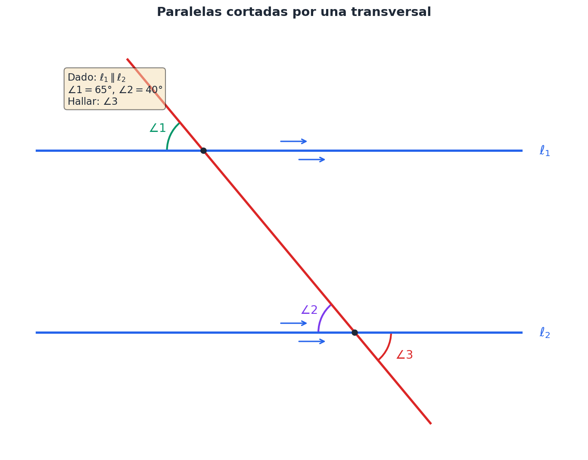

<!--
::METADATA::
type: problem_set
topic_id: fun-04-geometria
file_id: FUN-04-Problemas
status: stable
audience: student
-->

> 🏠 **Navegación:** [← Volver al Índice Principal](../../../glossary.md)

---

# Problemas de Geometría

> **Instrucciones:** Realiza diagramas claros y justifica cada paso con propiedades geométricas.

---

## 4.1 Conceptos Fundamentales

### [Prob-01] Clasificación de Afirmaciones Geométricas ⭐
Clasifica las siguientes afirmaciones como verdaderas o falsas y justifica:
a) Por dos puntos distintos pasa una única recta.
b) Tres puntos siempre determinan un único plano.
c) Dos rectas en el espacio siempre se intersecan.
d) Una semirrecta tiene dos puntos extremos.

📎 **Solución:** [📎 Ver Respuesta](../solutions/FUN-04-Respuestas.md#prob-01)

---

### [Prob-02] Puntos Colineales y Distancias ⭐
En una recta se marcan los puntos $A$, $B$, $C$ y $D$ en ese [orden](../../../glossary.md#orden). Si $AB = 3$ cm, $BC = 5$ cm y $AD = 12$ cm, encuentra $CD$.

📎 **Solución:** [📎 Ver Respuesta](../solutions/FUN-04-Respuestas.md#prob-02)

---

### [Prob-03] Punto Medio de un Segmento ⭐
El punto $M$ es punto medio del segmento $\overline{PQ}$. Si $PM = 2x + 3$ y $MQ = 5x - 9$, encuentra la longitud de $\overline{PQ}$.

📎 **Solución:** [📎 Ver Respuesta](../solutions/FUN-04-Respuestas.md#prob-03)

---

### [Prob-04] Puntos Colineales con Incógnitas ⭐⭐
Tres puntos colineales $A$, $B$ y $C$ satisfacen: $AB = 2x + 1$, $BC = x + 5$ y $AC = 4x - 2$. Determina cuál punto está entre los otros dos y calcula las distancias.

📎 **Solución:** [📎 Ver Respuesta](../solutions/FUN-04-Respuestas.md#prob-04)

---

### [Prob-05] Demostración sobre Puntos Medios ⭐⭐
Demuestra que si $M$ es punto medio de $\overline{AB}$ y $N$ es punto medio de $\overline{BC}$, entonces $MN = \frac{1}{2}AC$.

📎 **Solución:** [📎 Ver Respuesta](../solutions/FUN-04-Respuestas.md#prob-05)

---

### [Prob-06] Intersección Recta-Plano ⭐⭐
Una recta $\ell$ interseca a un plano $\pi$ en un único punto $P$. Si $A$ y $B$ son puntos de $\ell$ tales que $A$ está en el semiplano superior y $B$ en el inferior, ¿qué puedes concluir sobre la posición de $P$ respecto a $A$ y $B$?

📎 **Solución:** [📎 Ver Respuesta](../solutions/FUN-04-Respuestas.md#prob-06)

---

### [Prob-07] Planos con Puntos No Coplanares ⭐⭐⭐
Dados cuatro puntos no coplanares $A$, $B$, $C$ y $D$, ¿cuántos planos diferentes se pueden formar que contengan exactamente dos de estos puntos?

📎 **Solución:** [📎 Ver Respuesta](../solutions/FUN-04-Respuestas.md#prob-07)

---

## 4.2 Ángulos

### [Prob-08] Clasificación de Ángulos ⭐
Clasifica los siguientes ángulos: a) 47°, b) 90°, c) 123°, d) 180°, e) 215°, f) 360°.

📎 **Solución:** [📎 Ver Respuesta](../solutions/FUN-04-Respuestas.md#prob-08)

---

### [Prob-09] Ángulos Complementarios ⭐
Dos ángulos son complementarios. Uno mide el triple del otro. Encuentra ambos ángulos.

📎 **Solución:** [📎 Ver Respuesta](../solutions/FUN-04-Respuestas.md#prob-09)

---

### [Prob-10] Ángulos Suplementarios ⭐
Dos ángulos son suplementarios. Uno excede al otro en 36°. Calcula ambos ángulos.

📎 **Solución:** [📎 Ver Respuesta](../solutions/FUN-04-Respuestas.md#prob-10)

---

### [Prob-11] Rectas Concurrentes ⭐⭐
Tres rectas concurrentes forman seis ángulos. Si tres de los ángulos consecutivos miden $2x$, $3x$ y $x$, encuentra todos los ángulos.

📎 **Solución:** [📎 Ver Respuesta](../solutions/FUN-04-Respuestas.md#prob-11)

---

### [Prob-12] Paralelas con Transversal ⭐⭐
Dos rectas paralelas son cortadas por una transversal. Si un ángulo alterno interno mide $(3x + 15)°$ y su correspondiente mide $(5x - 25)°$, encuentra el valor de $x$ y todos los ángulos.

📎 **Solución:** [📎 Ver Respuesta](../solutions/FUN-04-Respuestas.md#prob-12)

---

### [Prob-13] Ángulos entre Paralelas ⭐⭐
En la figura, $\ell_1 \parallel \ell_2$. Si $\angle 1 = 65°$ y $\angle 2 = 40°$, encuentra $\angle 3$.

*Figura Prob-13: Rectas paralelas cortadas por una transversal*

📎 **Solución:** [📎 Ver Respuesta](../solutions/FUN-04-Respuestas.md#prob-13)

---

### [Prob-14] Ángulo y su Complemento ⭐⭐
Un ángulo mide $(2x + 30)°$. Si su complemento mide $(x + 15)°$, verifica que los datos son consistentes y encuentra $x$.

📎 **Solución:** [📎 Ver Respuesta](../solutions/FUN-04-Respuestas.md#prob-14)

---

### [Prob-15] Teorema de Thales ⭐⭐⭐
Tres rectas paralelas son cortadas por dos transversales. Si los segmentos en la primera transversal miden 4 cm y 6 cm, y un segmento en la segunda transversal mide 5 cm, encuentra el otro segmento (Teorema de Thales).

📎 **Solución:** [📎 Ver Respuesta](../solutions/FUN-04-Respuestas.md#prob-15)

---

### [Prob-16] Demostración Suma de Ángulos del Triángulo ⭐⭐⭐
Demuestra que la suma de los ángulos interiores de un triángulo es 180° usando el teorema de las paralelas cortadas por una transversal.

📎 **Solución:** [📂 Solución Desarrollada](../solutions/prob-16/solucion-metodo.md)

---

### [Prob-17] Ángulos de Diagonales de Cuadrilátero ⭐⭐⭐
En un cuadrilátero $ABCD$, las diagonales se intersecan en $O$. Si $\angle AOB = 110°$, encuentra $\angle COD$, $\angle BOC$ y $\angle AOD$.

📎 **Solución:** [📎 Ver Respuesta](../solutions/FUN-04-Respuestas.md#prob-17)

---

## 4.3 Triángulos

### [Prob-18] Clasificación de Triángulo por Ángulos ⭐
En un triángulo, dos ángulos miden 45° y 72°. Encuentra el tercer ángulo y clasifica el triángulo según sus ángulos.

📎 **Solución:** [📎 Ver Respuesta](../solutions/FUN-04-Respuestas.md#prob-18)

---

### [Prob-19] Triángulo Isósceles con Ángulo Obtuso ⭐
Un triángulo isósceles tiene un ángulo de 100°. Encuentra los otros dos ángulos.

📎 **Solución:** [📎 Ver Respuesta](../solutions/FUN-04-Respuestas.md#prob-19)

---

### [Prob-20] Clasificación de Triángulo por Lados ⭐
Los lados de un triángulo miden 5 cm, 12 cm y 13 cm. Clasifica el triángulo según sus lados y ángulos.

📎 **Solución:** [📎 Ver Respuesta](../solutions/FUN-04-Respuestas.md#prob-20)

---

### [Prob-21] Ángulo Exterior del Triángulo ⭐⭐
En un triángulo $ABC$, el ángulo exterior en $C$ mide 140°. Si $\angle A = 3\angle B$, encuentra los tres ángulos interiores.

📎 **Solución:** [📎 Ver Respuesta](../solutions/FUN-04-Respuestas.md#prob-21)

---

### [Prob-22] Ángulos en Razón ⭐⭐
Un triángulo tiene ángulos en la razón $2:3:4$. Encuentra cada ángulo.

📎 **Solución:** [📎 Ver Respuesta](../solutions/FUN-04-Respuestas.md#prob-22)

---

### [Prob-23] Desigualdad Triangular ⭐⭐
¿Es posible construir un triángulo con lados de 3 cm, 4 cm y 8 cm? Justifica usando la desigualdad triangular.

📎 **Solución:** [📎 Ver Respuesta](../solutions/FUN-04-Respuestas.md#prob-23)

---

### [Prob-24] Triángulo Equilátero Completo ⭐⭐
En un triángulo equilátero de lado 6 cm, encuentra la altura, el área y el radio del círculo inscrito.

📎 **Solución:** [📂 Solución Desarrollada](../solutions/prob-24/solucion-metodo.md)

---

### [Prob-25] Altura de Triángulo Isósceles ⭐⭐
La [base](../../../glossary.md#base) de un triángulo isósceles mide 10 cm y los lados iguales miden 13 cm cada uno. Calcula la altura correspondiente a la base.

📎 **Solución:** [📎 Ver Respuesta](../solutions/FUN-04-Respuestas.md#prob-25)

---

### [Prob-26] Ley de Senos ⭐⭐⭐
En el triángulo $ABC$, $\angle A = 60°$, $\angle B = 45°$ y $BC = 10$ cm. Usando la ley de senos, encuentra $AC$.

📎 **Solución:** [📎 Ver Respuesta](../solutions/FUN-04-Respuestas.md#prob-26)

---

### [Prob-27] Demostración del Centroide ⭐⭐⭐
Demuestra que los tres puntos de intersección de las medianas de un triángulo (centroide) dividen cada mediana en razón 2:1 desde el vértice.

📎 **Solución:** [📂 Solución Desarrollada](../solutions/prob-27/solucion-metodo.md)

---

### [Prob-28] Altura sobre la Hipotenusa ⭐⭐⭐
En un triángulo rectángulo, la hipotenusa mide 20 cm y la altura relativa a ella mide 9.6 cm. Encuentra los catetos.

📎 **Solución:** [📎 Ver Respuesta](../solutions/FUN-04-Respuestas.md#prob-28)

---

### [Prob-29] Triángulos Congruentes por Coordenadas ⭐⭐⭐
Determina si los triángulos con vértices $A(0,0)$, $B(4,0)$, $C(2,3)$ y $D(1,1)$, $E(5,1)$, $F(3,4)$ son congruentes.

📎 **Solución:** [📎 Ver Respuesta](../solutions/FUN-04-Respuestas.md#prob-29)

---

## 4.4 Cuadriláteros

### [Prob-30] Cuarto Ángulo del Cuadrilátero ⭐
La suma de los ángulos interiores de un cuadrilátero es 360°. Si tres ángulos miden 85°, 110° y 95°, encuentra el cuarto ángulo.

📎 **Solución:** [📎 Ver Respuesta](../solutions/FUN-04-Respuestas.md#prob-30)

---

### [Prob-31] Ángulos del Paralelogramo ⭐
En un paralelogramo, un ángulo mide 65°. Encuentra los demás ángulos.

📎 **Solución:** [📎 Ver Respuesta](../solutions/FUN-04-Respuestas.md#prob-31)

---

### [Prob-32] Lado del Rectángulo ⭐
Las diagonales de un rectángulo miden 10 cm. Si un lado mide 6 cm, encuentra el otro lado.

📎 **Solución:** [📎 Ver Respuesta](../solutions/FUN-04-Respuestas.md#prob-32)

---

### [Prob-33] Rombo: Perímetro y Área ⭐⭐
En un rombo, las diagonales miden 6 cm y 8 cm. Calcula el perímetro y el área.

📎 **Solución:** [📎 Ver Respuesta](../solutions/FUN-04-Respuestas.md#prob-33)

---

### [Prob-34] Trapecio Isósceles ⭐⭐
Un trapecio isósceles tiene bases de 8 cm y 14 cm, y altura de 4 cm. Encuentra el área y los lados no paralelos.

📎 **Solución:** [📎 Ver Respuesta](../solutions/FUN-04-Respuestas.md#prob-34)

---

### [Prob-35] Área de Paralelogramo con Diagonal ⭐⭐
En un paralelogramo $ABCD$, $AB = 10$ cm, $BC = 7$ cm y la diagonal $AC = 12$ cm. Calcula el área del paralelogramo.

📎 **Solución:** [📎 Ver Respuesta](../solutions/FUN-04-Respuestas.md#prob-35)

---

### [Prob-36] Cuadrado desde la Diagonal ⭐⭐
Las diagonales de un cuadrado miden $6\sqrt{2}$ cm. Calcula el lado, el perímetro y el área.

📎 **Solución:** [📎 Ver Respuesta](../solutions/FUN-04-Respuestas.md#prob-36)

---

### [Prob-37] Trapecio Rectángulo ⭐⭐⭐
En un trapecio rectángulo, la [base](../../../glossary.md#base) mayor mide 12 cm, la base [menor](../../../glossary.md#menor) mide 8 cm, y el lado perpendicular a las bases mide 5 cm. Encuentra el área y el lado oblicuo.

📎 **Solución:** [📎 Ver Respuesta](../solutions/FUN-04-Respuestas.md#prob-37)

---

### [Prob-38] Demostración Diagonales del Rombo ⭐⭐⭐
Demuestra que las diagonales de un rombo son bisectrices perpendiculares entre sí.

📎 **Solución:** [📎 Ver Respuesta](../solutions/FUN-04-Respuestas.md#prob-38)

---

### [Prob-39] Cuadrilátero por Coordenadas ⭐⭐⭐
Un cuadrilátero tiene vértices en $A(0,0)$, $B(5,0)$, $C(7,3)$ y $D(2,3)$. Clasifica el cuadrilátero y calcula su área.

📎 **Solución:** [📎 Ver Respuesta](../solutions/FUN-04-Respuestas.md#prob-39)

---

## 4.5 Polígonos

### [Prob-40] Suma de Ángulos del Octógono ⭐
Calcula la suma de los ángulos interiores de un octógono.

📎 **Solución:** [📎 Ver Respuesta](../solutions/FUN-04-Respuestas.md#prob-40)

---

### [Prob-41] Diagonales del Decágono ⭐
¿Cuántas diagonales tiene un decágono?

📎 **Solución:** [📎 Ver Respuesta](../solutions/FUN-04-Respuestas.md#prob-41)

---

### [Prob-42] Polígono Regular por Ángulo Interior ⭐
Cada ángulo interior de un polígono regular mide 140°. ¿Cuántos lados tiene?

📎 **Solución:** [📎 Ver Respuesta](../solutions/FUN-04-Respuestas.md#prob-42)

---

### [Prob-43] Lados del Polígono por Suma de Ángulos ⭐⭐
En un polígono convexo, la suma de los ángulos interiores es 2340°. ¿Cuántos lados tiene?

📎 **Solución:** [📎 Ver Respuesta](../solutions/FUN-04-Respuestas.md#prob-43)

---

### [Prob-44] Pentágono Regular: Apotema y Área ⭐⭐
Un pentágono regular tiene lado de 6 cm. Calcula su apotema y su área.

📎 **Solución:** [📎 Ver Respuesta](../solutions/FUN-04-Respuestas.md#prob-44)

---

### [Prob-45] Ángulo Central del Nonágono ⭐⭐
Calcula el ángulo central de un nonágono regular.

📎 **Solución:** [📎 Ver Respuesta](../solutions/FUN-04-Respuestas.md#prob-45)

---

### [Prob-46] Polígono por Ángulo Exterior ⭐⭐
¿Para qué valor de $n$ un polígono regular tiene ángulos exteriores de 30°?

📎 **Solución:** [📎 Ver Respuesta](../solutions/FUN-04-Respuestas.md#prob-46)

---

### [Prob-47] Hexágono Inscrito ⭐⭐⭐
Un hexágono regular está inscrito en un círculo de radio 8 cm. Calcula el perímetro y el área del hexágono.

📎 **Solución:** [📎 Ver Respuesta](../solutions/FUN-04-Respuestas.md#prob-47)

---

### [Prob-48] Demostración Ángulos Exteriores ⭐⭐⭐
Demuestra que la suma de los ángulos exteriores de cualquier polígono convexo es 360°.

📎 **Solución:** [📎 Ver Respuesta](../solutions/FUN-04-Respuestas.md#prob-48)

---

### [Prob-49] Polígono por Número de Diagonales ⭐⭐⭐
Un polígono regular tiene 77 diagonales. ¿Cuántos lados tiene y cuánto mide cada ángulo interior?

📎 **Solución:** [📎 Ver Respuesta](../solutions/FUN-04-Respuestas.md#prob-49)

---

## 4.6 Circunferencia y Círculo

### [Prob-50] Longitud y Área del Círculo ⭐
Una circunferencia tiene radio 7 cm. Calcula su longitud y el área del círculo.

📎 **Solución:** [📎 Ver Respuesta](../solutions/FUN-04-Respuestas.md#prob-50)

---

### [Prob-51] Diámetro desde el Área ⭐
El área de un círculo es $49\pi$ cm². Encuentra el diámetro y la longitud de la circunferencia.

📎 **Solución:** [📎 Ver Respuesta](../solutions/FUN-04-Respuestas.md#prob-51)

---

### [Prob-52] Longitud de Arco ⭐
Un arco de circunferencia subtiende un ángulo central de 60° en un círculo de radio 9 cm. Calcula la longitud del arco.

📎 **Solución:** [📎 Ver Respuesta](../solutions/FUN-04-Respuestas.md#prob-52)

---

### [Prob-53] Radio desde Cuerda y Distancia ⭐⭐
Una cuerda de 8 cm está a 3 cm del centro de un círculo. Encuentra el radio.

📎 **Solución:** [📎 Ver Respuesta](../solutions/FUN-04-Respuestas.md#prob-53)

---

### [Prob-54] Ángulo Inscrito y Arco ⭐⭐
Un ángulo inscrito en una circunferencia mide 35°. ¿Cuánto mide el arco que subtiende?

📎 **Solución:** [📎 Ver Respuesta](../solutions/FUN-04-Respuestas.md#prob-54)

---

### [Prob-55] Área del Sector Circular ⭐⭐
Calcula el área de un sector circular de ángulo 120° y radio 6 cm.

📎 **Solución:** [📎 Ver Respuesta](../solutions/FUN-04-Respuestas.md#prob-55)

---

### [Prob-56] Posición Relativa de Circunferencias ⭐⭐
Dos circunferencias tienen radios 5 cm y 12 cm, y la distancia entre sus centros es 13 cm. ¿Son tangentes exterior, tangentes interior, secantes o exteriores?

📎 **Solución:** [📎 Ver Respuesta](../solutions/FUN-04-Respuestas.md#prob-56)

---

### [Prob-57] Longitud de Tangente ⭐⭐⭐
Una [tangente](../../../glossary.md#tangente) a un círculo de radio 5 cm se [traza](../../../glossary.md#traza) desde un punto exterior a 13 cm del centro. Calcula la longitud de la tangente.

📎 **Solución:** [📎 Ver Respuesta](../solutions/FUN-04-Respuestas.md#prob-57)

---

### [Prob-58] Cuerdas Paralelas ⭐⭐⭐
En un círculo de radio 10 cm, dos cuerdas paralelas están a distancias de 6 cm y 8 cm del centro, en lados opuestos. Calcula la longitud de cada cuerda.

📎 **Solución:** [📎 Ver Respuesta](../solutions/FUN-04-Respuestas.md#prob-58)

---

### [Prob-59] Ángulos Inscritos sobre el Mismo Arco ⭐⭐⭐
En una circunferencia, el ángulo inscrito $\angle ABC = 40°$ y el ángulo inscrito $\angle ADC = 55°$ subtienden el mismo arco $AC$. ¿Es esto posible? Explica.

📎 **Solución:** [📎 Ver Respuesta](../solutions/FUN-04-Respuestas.md#prob-59)

---

### [Prob-60] Cuadrilátero Inscrito ⭐⭐⭐
Un cuadrilátero está inscrito en una circunferencia. Si un ángulo mide 75°, ¿cuánto mide el ángulo opuesto? Justifica.

📎 **Solución:** [📎 Ver Respuesta](../solutions/FUN-04-Respuestas.md#prob-60)

---

## 4.7 Áreas de Figuras Planas

### [Prob-61] Área de Triángulo ⭐
Calcula el área de un triángulo con base 12 cm y altura 8 cm.

📎 **Solución:** [📎 Ver Respuesta](../solutions/FUN-04-Respuestas.md#prob-61)

---

### [Prob-62] Área del Rectángulo ⭐
Un rectángulo tiene perímetro 34 cm y largo 12 cm. Encuentra el área.

📎 **Solución:** [📎 Ver Respuesta](../solutions/FUN-04-Respuestas.md#prob-62)

---

### [Prob-63] Área del Trapecio ⭐
Calcula el área de un trapecio con bases 10 cm y 16 cm, y altura 7 cm.

📎 **Solución:** [📎 Ver Respuesta](../solutions/FUN-04-Respuestas.md#prob-63)

---

### [Prob-64] Fórmula de Herón ⭐⭐
Un triángulo tiene lados de 13 cm, 14 cm y 15 cm. Calcula su área usando la fórmula de Herón.

📎 **Solución:** [📂 Solución Desarrollada](../solutions/prob-64/solucion-metodo.md)

---

### [Prob-65] Rombo: Área y Perímetro ⭐⭐
Un rombo tiene diagonales de 10 cm y 24 cm. Calcula su área y su perímetro.

📎 **Solución:** [📎 Ver Respuesta](../solutions/FUN-04-Respuestas.md#prob-65)

---

### [Prob-66] Figura Compuesta ⭐⭐
Una figura compuesta consiste en un rectángulo de 8 cm × 6 cm con un semicírculo de diámetro 6 cm adosado a un lado. Calcula el área total.

📎 **Solución:** [📎 Ver Respuesta](../solutions/FUN-04-Respuestas.md#prob-66)

---

### [Prob-67] Área del Cuadrado por Diagonal ⭐⭐
Un cuadrado tiene diagonal de 10 cm. Encuentra su área de dos formas diferentes.

📎 **Solución:** [📎 Ver Respuesta](../solutions/FUN-04-Respuestas.md#prob-67)

---

### [Prob-68] Comparación de Áreas: Triángulo vs Cuadrado ⭐⭐⭐
Un triángulo equilátero y un cuadrado tienen el mismo perímetro de 24 cm. ¿Cuál tiene mayor área?

📎 **Solución:** [📎 Ver Respuesta](../solutions/FUN-04-Respuestas.md#prob-68)

---

### [Prob-69] Hexágono Inscrito: Área Sombreada ⭐⭐⭐
Calcula el área de la región sombreada si un círculo de radio 6 cm tiene inscrito un hexágono regular.

📎 **Solución:** [📎 Ver Respuesta](../solutions/FUN-04-Respuestas.md#prob-69)

---

### [Prob-70] Camino Interior ⭐⭐⭐
Un campo rectangular de 80 m × 60 m tiene un camino de 2 m de ancho alrededor del interior. Calcula el área del camino.

📎 **Solución:** [📎 Ver Respuesta](../solutions/FUN-04-Respuestas.md#prob-70)

---

### [Prob-71] Sector Circular a Cono ⭐⭐⭐
Un sector circular de radio 12 cm y ángulo 90° se convierte en un cono. Calcula el radio de la base del cono.

📎 **Solución:** [📎 Ver Respuesta](../solutions/FUN-04-Respuestas.md#prob-71)

---

## 4.8 Semejanza

### [Prob-72] Triángulos Semejantes ⭐
Los lados de un triángulo miden 3 cm, 4 cm y 5 cm. Los lados de otro triángulo miden 6 cm, 8 cm y 10 cm. ¿Son semejantes?

📎 **Solución:** [📎 Ver Respuesta](../solutions/FUN-04-Respuestas.md#prob-72)

---

### [Prob-73] Razón de Semejanza ⭐
Dos triángulos semejantes tienen razón de semejanza 3:5. Si un lado del triángulo [menor](../../../glossary.md#menor) mide 9 cm, ¿cuánto mide el lado correspondiente del mayor?

📎 **Solución:** [📎 Ver Respuesta](../solutions/FUN-04-Respuestas.md#prob-73)

---

### [Prob-74] Paralela a un Lado del Triángulo ⭐⭐
En un triángulo $ABC$, se [traza](../../../glossary.md#traza) una paralela al lado $BC$ que corta a $AB$ en $D$ y a $AC$ en $E$. Si $AD = 4$ cm, $DB = 6$ cm y $DE = 5$ cm, encuentra $BC$.

📎 **Solución:** [📎 Ver Respuesta](../solutions/FUN-04-Respuestas.md#prob-74)

---

### [Prob-75] Sombras y Semejanza ⭐⭐
La sombra de un poste de 8 m de altura mide 6 m. A la misma hora, la sombra de un edificio mide 45 m. ¿Cuál es la altura del edificio?

📎 **Solución:** [📎 Ver Respuesta](../solutions/FUN-04-Respuestas.md#prob-75)

---

### [Prob-76] Razón de Áreas ⭐⭐
Dos triángulos semejantes tienen áreas de 25 cm² y 100 cm². Si un lado del triángulo menor mide 6 cm, encuentra el lado correspondiente del mayor.

📎 **Solución:** [📎 Ver Respuesta](../solutions/FUN-04-Respuestas.md#prob-76)

---

### [Prob-77] Altura sobre la Hipotenusa y Semejanza ⭐⭐
En el triángulo rectángulo $ABC$ (recto en $C$), la altura $CH$ a la hipotenusa divide a esta en $AH = 4$ cm y $HB = 9$ cm. Calcula $CH$, $AC$ y $BC$.

📎 **Solución:** [📂 Solución Desarrollada](../solutions/prob-77/solucion-metodo.md)

---

### [Prob-78] Demostración Criterio AA ⭐⭐⭐
Demuestra el criterio AA de semejanza: si dos triángulos tienen dos ángulos iguales, son semejantes.

📎 **Solución:** [📎 Ver Respuesta](../solutions/FUN-04-Respuestas.md#prob-78)

---

### [Prob-79] Semejanza en Trapecio ⭐⭐⭐
En un trapecio $ABCD$ con $AB \parallel CD$, las diagonales se intersecan en $O$. Demuestra que $\triangle AOB \sim \triangle COD$.

📎 **Solución:** [📎 Ver Respuesta](../solutions/FUN-04-Respuestas.md#prob-79)

---

### [Prob-80] Ampliación Fotográfica ⭐⭐⭐
Una fotografía de 10 cm × 15 cm se amplía de modo que el lado menor pasa a medir 25 cm. ¿Cuáles son las nuevas dimensiones? ¿Cuál es la razón entre las áreas?

📎 **Solución:** [📎 Ver Respuesta](../solutions/FUN-04-Respuestas.md#prob-80)

---

### [Prob-81] Áreas de Polígonos Semejantes ⭐⭐⭐
Dos polígonos semejantes tienen perímetros de 20 cm y 35 cm. Si el área del menor es 48 cm², calcula el área del mayor.

📎 **Solución:** [📎 Ver Respuesta](../solutions/FUN-04-Respuestas.md#prob-81)

---

## 4.9 Teorema de Pitágoras

### [Prob-82] Hipotenusa Básica ⭐
En un triángulo rectángulo, los catetos miden 6 cm y 8 cm. Calcula la hipotenusa.

📎 **Solución:** [📎 Ver Respuesta](../solutions/FUN-04-Respuestas.md#prob-82)

---

### [Prob-83] Cateto Faltante ⭐
La hipotenusa de un triángulo rectángulo mide 17 cm y un cateto mide 8 cm. Encuentra el otro cateto.

📎 **Solución:** [📎 Ver Respuesta](../solutions/FUN-04-Respuestas.md#prob-83)

---

### [Prob-84] Verificar Triángulo Rectángulo ⭐
Determina si un triángulo con lados 7, 24 y 25 es rectángulo.

📎 **Solución:** [📎 Ver Respuesta](../solutions/FUN-04-Respuestas.md#prob-84)

---

### [Prob-85] Escalera Apoyada ⭐⭐
Una escalera de 5 m de largo se apoya contra una pared. Si el pie de la escalera está a 3 m de la base de la pared, ¿a qué altura de la pared llega la escalera?

📎 **Solución:** [📎 Ver Respuesta](../solutions/FUN-04-Respuestas.md#prob-85)

---

### [Prob-86] Diagonal del Rectángulo ⭐⭐
Un rectángulo tiene lados de 5 cm y 12 cm. Calcula la longitud de su diagonal.

📎 **Solución:** [📎 Ver Respuesta](../solutions/FUN-04-Respuestas.md#prob-86)

---

### [Prob-87] Diagonal del Cuadrado ⭐⭐
El lado de un cuadrado mide 8 cm. Calcula la longitud de la diagonal.

📎 **Solución:** [📎 Ver Respuesta](../solutions/FUN-04-Respuestas.md#prob-87)

---

### [Prob-88] Lado del Rombo ⭐⭐
Una cometa tiene forma de rombo con diagonales de 30 cm y 40 cm. ¿Cuánto mide cada lado de la cometa?

📎 **Solución:** [📎 Ver Respuesta](../solutions/FUN-04-Respuestas.md#prob-88)

---

### [Prob-89] Distancia de Vuelo ⭐⭐⭐
Un avión vuela 300 km hacia el este y luego 400 km hacia el norte. ¿A qué distancia en línea recta se encuentra del punto de partida?

📎 **Solución:** [📎 Ver Respuesta](../solutions/FUN-04-Respuestas.md#prob-89)

---

### [Prob-90] Triángulo Isósceles: Altura y Área ⭐⭐⭐
En un triángulo isósceles, la base mide 16 cm y los lados iguales miden 17 cm. Calcula la altura correspondiente a la base y el área.

📎 **Solución:** [📎 Ver Respuesta](../solutions/FUN-04-Respuestas.md#prob-90)

---

### [Prob-91] Demostración Fórmula de la Altura ⭐⭐⭐
Demuestra que en un triángulo rectángulo con catetos $a$ y $b$ e hipotenusa $c$, si $h$ es la altura al la hipotenusa, entonces $\frac{1}{h^2} = \frac{1}{a^2} + \frac{1}{b^2}$.

📎 **Solución:** [📎 Ver Respuesta](../solutions/FUN-04-Respuestas.md#prob-91)

---

### [Prob-92] Diagonal del Cubo ⭐⭐⭐
Un cubo tiene arista de 6 cm. Calcula la diagonal del cubo (diagonal espacial).

📎 **Solución:** [📎 Ver Respuesta](../solutions/FUN-04-Respuestas.md#prob-92)

---

### [Prob-93] Triángulo Rectángulo con Incógnitas ⭐⭐⭐
En un triángulo rectángulo, un cateto mide $x$, el otro cateto mide $x + 7$ y la hipotenusa mide $x + 8$. Encuentra las medidas de los lados.

📎 **Solución:** [📎 Ver Respuesta](../solutions/FUN-04-Respuestas.md#prob-93)

---

## 4.10 Geometría del Espacio

### [Prob-94] Prisma Rectangular ⭐
Un prisma rectangular tiene dimensiones 3 cm × 4 cm × 5 cm. Calcula su volumen y área total.

📎 **Solución:** [📎 Ver Respuesta](../solutions/FUN-04-Respuestas.md#prob-94)

---

### [Prob-95] Cubo Completo ⭐
Un cubo tiene arista de 7 cm. Calcula su volumen, área total y la diagonal del cubo.

📎 **Solución:** [📎 Ver Respuesta](../solutions/FUN-04-Respuestas.md#prob-95)

---

### [Prob-96] Pirámide Cuadrangular ⭐
Una pirámide cuadrangular tiene base de 10 cm de lado y altura de 12 cm. Calcula su volumen.

📎 **Solución:** [📎 Ver Respuesta](../solutions/FUN-04-Respuestas.md#prob-96)

---

### [Prob-97] Cilindro Completo ⭐⭐
Un cilindro tiene radio 5 cm y altura 10 cm. Calcula su volumen, área lateral y área total.

📎 **Solución:** [📎 Ver Respuesta](../solutions/FUN-04-Respuestas.md#prob-97)

---

### [Prob-98] Cono Completo ⭐⭐
Un cono tiene radio de base 6 cm y altura 8 cm. Calcula su generatriz, volumen y área total.

📎 **Solución:** [📎 Ver Respuesta](../solutions/FUN-04-Respuestas.md#prob-98)

---

### [Prob-99] Esfera ⭐⭐
Una esfera tiene radio 9 cm. Calcula su volumen y área superficial.

📎 **Solución:** [📎 Ver Respuesta](../solutions/FUN-04-Respuestas.md#prob-99)

---

### [Prob-100] Prisma Hexagonal ⭐⭐
Un prisma hexagonal regular tiene arista de la base de 4 cm y altura de 10 cm. Calcula el volumen.

📎 **Solución:** [📎 Ver Respuesta](../solutions/FUN-04-Respuestas.md#prob-100)

---

### [Prob-101] Volumen de Cono vs Cilindro ⭐⭐⭐
Un cono y un cilindro tienen la misma base y la misma altura. Si el volumen del cilindro es 450 cm³, ¿cuál es el volumen del cono?

📎 **Solución:** [📎 Ver Respuesta](../solutions/FUN-04-Respuestas.md#prob-101)

---

### [Prob-102] Sólido Compuesto ⭐⭐⭐
Una semiesfera de radio 6 cm está colocada sobre un cilindro del mismo radio y altura 10 cm. Calcula el volumen total del sólido compuesto.

📎 **Solución:** [📎 Ver Respuesta](../solutions/FUN-04-Respuestas.md#prob-102)

---

### [Prob-103] Tanque Cilíndrico Horizontal ⭐⭐⭐
Un tanque cilíndrico horizontal de radio 1 m y longitud 4 m está lleno de agua hasta la mitad. Calcula el volumen de agua.

📎 **Solución:** [📎 Ver Respuesta](../solutions/FUN-04-Respuestas.md#prob-103)

---

### [Prob-104] Pirámide con Mismo Volumen que Cono ⭐⭐⭐
Una pirámide cuadrangular tiene el mismo volumen que un cono de radio 6 cm y altura 10 cm. Si la base de la pirámide es un cuadrado de 9 cm de lado, ¿cuál es la altura de la pirámide?

📎 **Solución:** [📎 Ver Respuesta](../solutions/FUN-04-Respuestas.md#prob-104)

---

### [Prob-105] Tronco de Cono ⭐⭐⭐
Un tronco de cono tiene radios 3 cm y 6 cm, y altura 4 cm. Calcula su volumen.

📎 **Solución:** [📎 Ver Respuesta](../solutions/FUN-04-Respuestas.md#prob-105)

---

## 4.S Problemas de Síntesis

### [Prob-106] Ley de Cosenos ⭐⭐⭐
En un triángulo $ABC$, $\angle A = 60°$, $AB = 8$ cm y $AC = 10$ cm. Calcula $BC$ usando la ley de cosenos.

📎 **Solución:** [📎 Ver Respuesta](../solutions/FUN-04-Respuestas.md#prob-106)

---

### [Prob-107] Razón de Áreas: Hexágono vs Cuadrado ⭐⭐⭐
Un hexágono regular está inscrito en un círculo de radio $R$. Un cuadrado está inscrito en el mismo círculo. ¿Cuál es la razón entre sus áreas?

📎 **Solución:** [📎 Ver Respuesta](../solutions/FUN-04-Respuestas.md#prob-107)

---

### [Prob-108] Ventana con Semicírculo ⭐⭐⭐
Una ventana tiene forma de rectángulo coronado por un semicírculo. Si el ancho es 2 m y la altura total es 3 m, calcula el área de la ventana.

📎 **Solución:** [📎 Ver Respuesta](../solutions/FUN-04-Respuestas.md#prob-108)

---

### [Prob-109] Cuerdas Perpendiculares ⭐⭐⭐⭐
En un círculo de radio 10 cm, se inscriben dos cuerdas perpendiculares que se cortan. Si una cuerda está a 6 cm del centro y la otra a 8 cm, encuentra las longitudes de las cuerdas y el área del cuadrilátero que forman.

📎 **Solución:** [📎 Ver Respuesta](../solutions/FUN-04-Respuestas.md#prob-109)

---

### [Prob-110] Triángulo Inscrito de Área Máxima ⭐⭐⭐⭐
Demuestra que el área de un triángulo inscrito en un círculo de radio $R$ es máxima cuando el triángulo es equilátero, y calcula dicha área máxima.

📎 **Solución:** [📎 Ver Respuesta](../solutions/FUN-04-Respuestas.md#prob-110)

---
