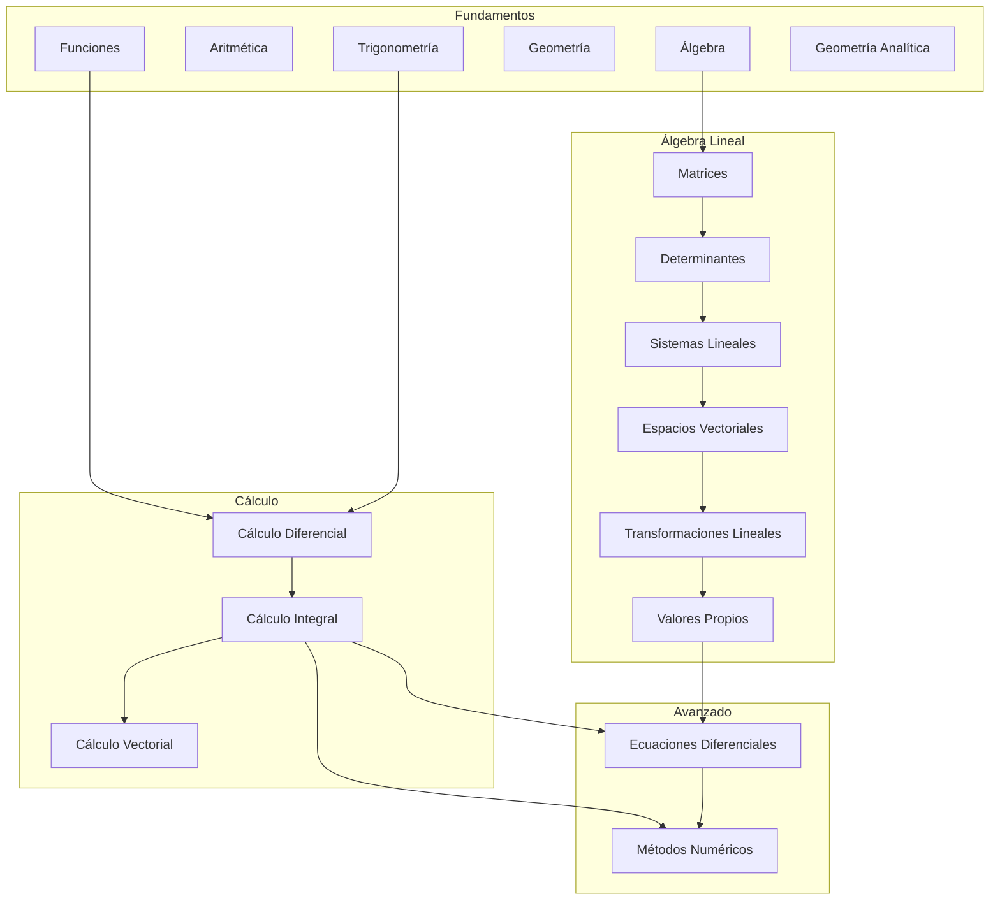

<!--
HUMANO:
Este archivo es la puerta de entrada del repositorio.
Debe permitir entender la estructura, propósito y cómo navegar el contenido.

IA:
Este archivo define el CONTEXTO GLOBAL del repositorio.
Úsalo como referencia primaria antes de generar cualquier contenido.
Respeta la estructura definida aquí.

---
content_type: repository_overview
expected_output:
  default: markdown
  alternative:
    - natural_language
    - summary
audience: self-study
formality: technical
---
-->

# Repositorio de Matemáticas Universitarias

## Propósito del repositorio

<!--
HUMANO: ¿Qué problemas resuelve este repositorio?
IA: Usa esto para entender el alcance y objetivos.
-->

Este repositorio contiene material de estudio para matemáticas universitarias, organizado de forma estructurada para:
- Facilitar el auto-estudio
- Permitir generación asistida por IA
- Mantener consistencia y claridad en el contenido

## Estructura del repositorio

```text
MATEMATICAS/
│
├── README.md                  ← Estás aquí
├── glossary.md                ← Glosario de términos
│
├── .assets/                   ← Recursos globales
│
├── 00-META/                   ← Metadatos y guías
│   ├── study-guide.md
│   ├── ia-contract.md
│   ├── notation-cheatsheet.md
│   └── repo-tests.md
│
├── 01-Fundamentos/            ← Funciones, Aritmética, Álgebra, Geometría, Trigonometría
│   ├── 00-Index.md
│   ├── 01-Funciones/
│   ├── 02-Aritmetica/
│   ├── 03-Algebra/
│   ├── 04-Geometria/
│   ├── 05-Trigonometria/
│   └── 06-Geometria-Analitica/
│
├── 02-Algebra-Lineal/         ← Matrices, Determinantes, Espacios Vectoriales
│   ├── 00-Index.md
│   ├── 01-Matrices/
│   ├── 02-Determinantes/
│   ├── 03-Sistemas-Lineales/
│   ├── 04-Espacios-Vectoriales/
│   ├── 05-Transformaciones-Lineales/
│   └── 06-Valores-Vectores-Propios/
│
├── 03-Calculo-Diferencial/    ← Límites y Derivadas
│   ├── 00-Index.md
│   └── 01-Limites/
│
├── 04-Calculo-Integral/       ← Integrales y Aplicaciones
│   ├── 00-Index.md
│   ├── 01-Integral-Indefinida/
│   ├── 02-Tecnicas-Integracion/
│   ├── 03-Integral-Definida/
│   ├── 04-Aplicaciones-Integral/
│   └── 05-Integrales-Impropias/
│
├── 05-Calculo-Vectorial/      ← Cálculo Multivariable
│   └── 00-Index.md
│
├── 06-Ecuaciones-Diferenciales/ ← EDO y EDP
│   ├── 00-Index.md
│   ├── 01-Introduccion-EDO/
│   ├── 02-EDO-Primer-Orden/
│   ├── 03-EDO-Segundo-Orden/
│   ├── 04-Sistemas-EDO/
│   └── 05-Transformada-Laplace/
│
└── 07-Metodos-Numericos/      ← Métodos Numéricos
    ├── 00-Index.md
    ├── 01-Raices-Ecuaciones/
    ├── 02-Interpolacion/
    ├── 03-Integracion-Numerica/
    └── 04-EDO-Numericas/
```

## Cómo usar este repositorio

<!--
IA: Sigue estas instrucciones al interactuar con usuarios.
-->

### Para estudiantes:
1. Comienza leyendo [00-META/study-guide.md](./00-META/study-guide.md)
2. Navega los módulos en orden numérico
3. Dentro de cada tema, sigue: README → theory → methods → problems

### Para IA (Copilot):
1. Lee siempre [00-META/ia-contract.md](./00-META/ia-contract.md) primero
2. Respeta la separación semántica de contenido
3. Genera contenido siguiendo las plantillas establecidas

## Módulos disponibles

| Módulo | Descripción | Subtemas | Estado |
|--------|-------------|----------|--------|
| [01-Fundamentos](./01-Fundamentos/00-Index.md) | Bases matemáticas | 6 | ✅ Completo |
| [02-Algebra-Lineal](./02-Algebra-Lineal/00-Index.md) | Matrices, espacios vectoriales, transformaciones | 6 | ✅ Completo |
| [03-Calculo-Diferencial](./03-Calculo-Diferencial/00-Index.md) | Límites y derivadas | 1 | 🔄 En desarrollo |
| [04-Calculo-Integral](./04-Calculo-Integral/00-Index.md) | Integrales y aplicaciones | 5 | ✅ Completo |
| [05-Calculo-Vectorial](./05-Calculo-Vectorial/00-Index.md) | Cálculo multivariable | - | ⏳ Pendiente |
| [06-Ecuaciones-Diferenciales](./06-Ecuaciones-Diferenciales/00-Index.md) | EDO, sistemas, Laplace | 5 | ✅ Completo |
| [07-Metodos-Numericos](./07-Metodos-Numericos/00-Index.md) | Raíces, interpolación, integración, EDO numéricas | 4 | ✅ Completo |

## Skill tree (Mapa de dependencias)



## Referencias rápidas

- [Glosario de términos](./glossary.md)
- [Notación matemática](./00-META/notation-cheatsheet.md)
- [Guía de estudio](./00-META/study-guide.md)

---

<!--
IA: Este README define la estructura canónica.
No modifiques la estructura sin actualizar este archivo.
Todo tema nuevo debe seguir el patrón establecido.
-->
