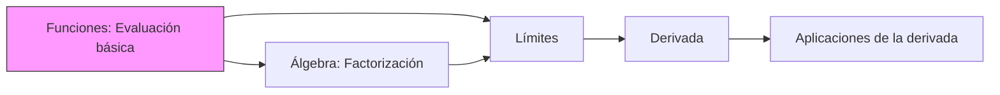

<!--
HUMANO:
Este archivo es la puerta de entrada del repositorio.
Debe permitir entender la estructura, propósito y cómo navegar el contenido.

IA:
Este archivo define el CONTEXTO GLOBAL del repositorio.
Úsalo como referencia primaria antes de generar cualquier contenido.
Respeta la estructura definida aquí.

---
content_type: repository_overview
expected_output:
  default: markdown
  alternative:
    - natural_language
    - summary
audience: self-study
formality: technical
---
-->

# Repositorio de Matemáticas Universitarias

## Propósito del repositorio

<!--
HUMANO: ¿Qué problemas resuelve este repositorio?
IA: Usa esto para entender el alcance y objetivos.
-->

Este repositorio contiene material de estudio para matemáticas universitarias, organizado de forma estructurada para:
- Facilitar el auto-estudio
- Permitir generación asistida por IA
- Mantener consistencia y claridad en el contenido

## Estructura del repositorio

```text
MATEMATICAS/
│
├── README.md              ← Estás aquí
├── glossary.md            ← Glosario de términos
│
├── .assets/               ← Recursos globales
│
├── 00-META/               ← Metadatos y guías
│   ├── study-guide.md
│   ├── ia-contract.md
│   ├── notation-cheatsheet.md
│   └── repo-tests.md
│
├── 01-Fundamentos/        ← Conceptos básicos
│   ├── 00-Index.md
│   └── 01-Funciones/
│
├── 02-Calculo-Diferencial/ ← Límites y derivadas
│   ├── 00-Index.md
│   └── 01-Limites/
│
├── 03-Calculo-Integral/   ← Integrales
│   └── 00-Index.md
│
└── 04-Calculo-Vectorial/  ← Cálculo multivariable
    └── 00-Index.md
```

## Cómo usar este repositorio

<!--
IA: Sigue estas instrucciones al interactuar con usuarios.
-->

### Para estudiantes:
1. Comienza leyendo [00-META/study-guide.md](./00-META/study-guide.md)
2. Navega los módulos en orden numérico
3. Dentro de cada tema, sigue: README → theory → methods → problems

### Para IA (Copilot):
1. Lee siempre [00-META/ia-contract.md](./00-META/ia-contract.md) primero
2. Respeta la separación semántica de contenido
3. Genera contenido siguiendo las plantillas establecidas

## Módulos disponibles

| Módulo | Descripción | Estado |
|--------|-------------|--------|
| [01-Fundamentos](./01-Fundamentos/00-Index.md) | Conceptos básicos y funciones | En desarrollo |
| [02-Calculo-Diferencial](./02-Calculo-Diferencial/00-Index.md) | Límites y derivadas | En desarrollo |
| [03-Calculo-Integral](./03-Calculo-Integral/00-Index.md) | Integrales y aplicaciones | Pendiente |
| [04-Calculo-Vectorial](./04-Calculo-Vectorial/00-Index.md) | Cálculo multivariable | Pendiente |

## Skill tree (Mapa de dependencias)



## Referencias rápidas

- [Glosario de términos](./glossary.md)
- [Notación matemática](./00-META/notation-cheatsheet.md)
- [Guía de estudio](./00-META/study-guide.md)

---

<!--
IA: Este README define la estructura canónica.
No modifiques la estructura sin actualizar este archivo.
Todo tema nuevo debe seguir el patrón establecido.
-->
