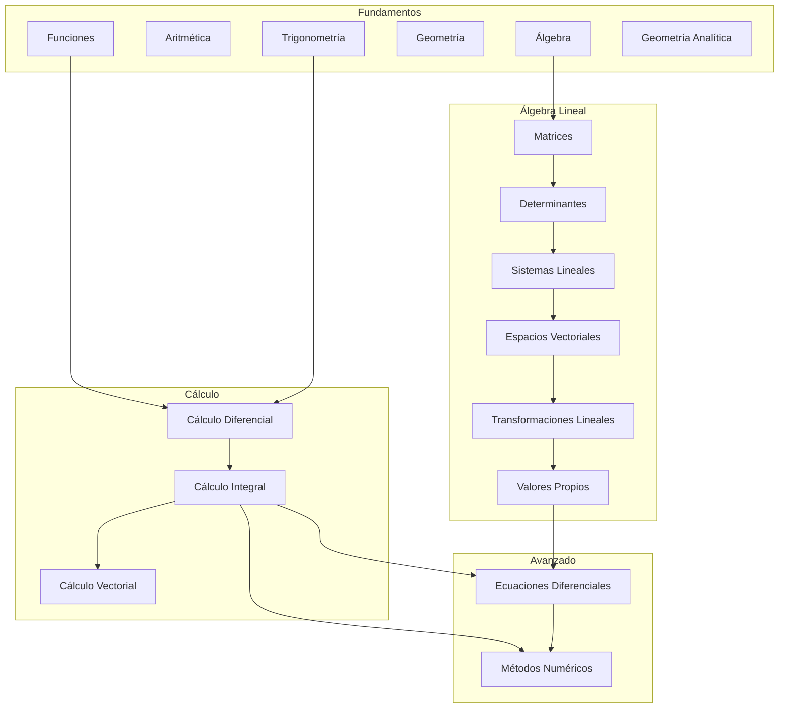

<!--
::METADATA::
type: index
topic_id: repo-readme
file_id: README
status: stable
audience: student
last_updated: 2025-12-30
-->

# Repositorio de Matemáticas Universitarias

## Propósito del repositorio

<!--
HUMANO: ¿Qué problemas resuelve este repositorio?
IA: Usa esto para entender el alcance y objetivos.
-->

Este repositorio contiene material de estudio para matemáticas universitarias, organizado de forma estructurada para:
- Facilitar el auto-estudio
- Permitir generación asistida por IA
- Mantener consistencia y claridad en el contenido

## Estructura del repositorio

```text
MATEMATICAS/
│
├── README.md                  ← Estás aquí
├── glossary.md                ← Glosario de términos (~150 términos)
│
├── 00-META/                   ← Configuración y guías
│   ├── ia-contract.md         ← Contrato principal para IA
│   ├── study-guide.md         ← Guía de estudio
│   ├── notation-cheatsheet.md ← Símbolos y notación
│   ├── nomenclatura-estandar.md
│   └── tools/
│       └── validate_repo.py   ← Validador del repositorio
│
├── 01-Fundamentos/            ← Simbología, Aritmética, Álgebra, Geometría, Trigonometría
│   ├── 00-Index.md
│   ├── 01-Simbologia-Matematica/
│   ├── 02-Aritmetica/
│   ├── 03-Algebra/
│   ├── 04-Geometria/
│   ├── 05-Trigonometria/
│   └── 06-Geometria-Analitica/
│
├── 02-Algebra-Lineal/         ← Matrices, Determinantes, Espacios Vectoriales
│   ├── 00-Index.md
│   ├── 01-Matrices/
│   ├── 02-Determinantes/
│   ├── 03-Sistemas-Lineales/
│   ├── 04-Espacios-Vectoriales/
│   ├── 05-Transformaciones-Lineales/
│   └── 06-Valores-Vectores-Propios/
│
├── 03-Calculo-Diferencial/    ← Límites, Derivadas, Aplicaciones
│   ├── 00-Index.md
│   ├── 01-Limites/
│   ├── 02-Derivadas/
│   ├── 03-Aplicaciones-de-la-derivada/
│   └── 04-Teoremas-fundamentales/
│
├── 04-Calculo-Integral/       ← Integrales y Aplicaciones
│   ├── 00-Index.md
│   ├── 01-Integral-Indefinida/
│   ├── 02-Tecnicas-Integracion/
│   ├── 03-Integral-Definida/
│   ├── 04-Aplicaciones-Integral/
│   └── 05-Integrales-Impropias/
│
├── 05-Calculo-Vectorial/      ← Cálculo Multivariable
│   ├── 00-Index.md
│   ├── 01-Vectores-en-el-espacio/
│   ├── 02-Curvas-planas-parametricas-y-polares/
│   ├── 03-Funciones-vectoriales/
│   ├── 04-Funciones-de-varias-variables/
│   └── 05-Integracion-multiple/
│
├── 06-Ecuaciones-Diferenciales/
│   ├── 00-Index.md
│   ├── 01-EDO-Primer-Orden/
│   ├── 02-EDO-Segundo-Orden/
│   ├── 03-Sistemas-EDO/
│   ├── 04-Transformada-Laplace/
│   └── 05-Series-Potencias/
│
└── 07-Metodos-Numericos/
    ├── 00-Index.md
    ├── 01-Raices-Ecuaciones/
    ├── 02-Interpolacion/
    ├── 03-Integracion-Numerica/
    └── 04-EDO-Numericas/
```

## Cómo usar este repositorio

### Para estudiantes:
1. Comienza leyendo [00-META/study-guide.md](./00-META/study-guide.md)
2. Navega los módulos en orden numérico
3. Dentro de cada tema, sigue: `*-Intro.md` → `theory/` → `methods/` → `problems/`
4. Consulta `*-Resumen-Formulas.md` para repaso rápido

### Para IA (Copilot):
1. Lee siempre [00-META/ia-contract.md](./00-META/ia-contract.md) primero
2. Respeta la nomenclatura: `[PREFIJO]-[XX]-[Contenido].md`
3. Usa el `manifest.json` de cada tema para ubicar recursos

## Módulos disponibles

| Módulo | Prefijo | Descripción | Subtemas | Estado |
|--------|---------|-------------|----------|--------|
| [01-Fundamentos](./01-Fundamentos/00-Index.md) | `FUN` | Bases matemáticas | 6 | ✅ Completo |
| [02-Algebra-Lineal](./02-Algebra-Lineal/00-Index.md) | `AL` | Matrices, espacios vectoriales | 6 | ✅ Completo |
| [03-Calculo-Diferencial](./03-Calculo-Diferencial/00-Index.md) | `CD` | Límites, derivadas, aplicaciones | 4 | ✅ Completo |
| [04-Calculo-Integral](./04-Calculo-Integral/00-Index.md) | `CI` | Integrales y aplicaciones | 5 | ✅ Completo |
| [05-Calculo-Vectorial](./05-Calculo-Vectorial/00-Index.md) | `CV` | Cálculo multivariable | 5 | ✅ Completo |
| [06-Ecuaciones-Diferenciales](./06-Ecuaciones-Diferenciales/00-Index.md) | `ED` | EDO, sistemas, Laplace | 5 | ✅ Completo |
| [07-Metodos-Numericos](./07-Metodos-Numericos/00-Index.md) | `MN` | Métodos numéricos | 4 | ✅ Completo |

## Skill tree (Mapa de dependencias)



## Referencias rápidas

| Recurso | Descripción |
|---------|-------------|
| [Glosario](./glossary.md) | ~150 términos con analogías |
| [Guía de estudio](./00-META/study-guide.md) | Rutas de aprendizaje |
| [Notación](./00-META/notation-cheatsheet.md) | Símbolos y convenciones |
| [Contrato IA](./00-META/ia-contract.md) | Reglas para generación |
| [Validador](./00-META/tools/validate_repo.py) | Verificar integridad |

---

*Última actualización: 2025-12-30*
