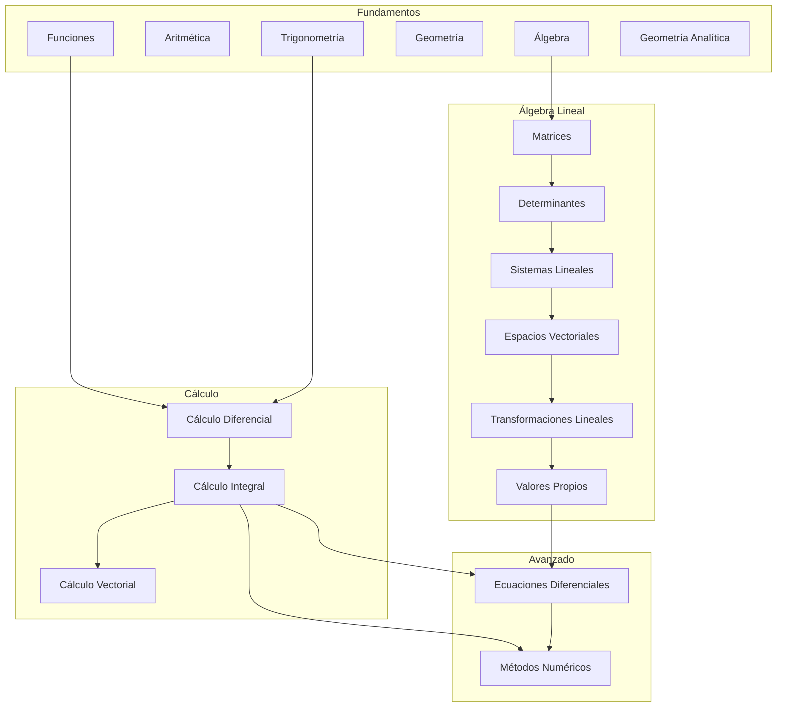

<!--
::METADATA::
type: index
topic_id: repo-readme
file_id: README
status: stable
audience: student
last_updated: 2026-01-02
-->

> 🌐 **Navegación:** [🗺️ Wiki Index - Mapa del Repositorio](glossary.md)

---

# Repositorio de Matemáticas Universitarias

## 🌱 Jardín Digital Interconectado

Este repositorio ha sido transformado en un **Jardín Digital** estilo Wikipedia, donde:

- 🔗 **Términos enlazados:** La primera mención de cada término del glosario en cada archivo está automáticamente vinculada a su definición
- 🗺️ **Índice Wiki:** Un [mapa de navegación centralizado](WIKI_INDEX.md) para ver todo el contenido organizado
2. Lee la [Guía de estudio](glossary.md) para consultar definiciones

### Para IA (Copilot):
1. Lee siempre [00-META/ia-contract.md](00-META/ia-contract.md) primero
2. Respeta la nomenclatura: `[PREFIJO]-[XX]-[Contenido].md`
3. Usa el `manifest.json` de cada tema para ubicar recursos
4. Los términos del glosario están auto-vinculados en el contenido

## Módulos disponibles

| Módulo | Prefijo | Descripción | Subtemas | Estado |
|--------|---------|-------------|----------|--------|
| [01-Fundamentos](02-Algebra-Lineal/00-Index.md) | `AL` | Matrices, espacios vectoriales | 6 | ✅ Completo |
| [03-Calculo-Diferencial](04-Calculo-Integral/00-Index.md) | `CI` | Integrales y aplicaciones | 5 | ✅ Completo |
| [05-Calculo-Vectorial](06-Ecuaciones-Diferenciales/00-Index.md) | `ED` | EDO, sistemas, Laplace | 5 | ✅ Completo |
| [07-Metodos-Numericos](07-Metodos-Numericos/00-Index.md) | `MN` | Métodos numéricos | 4 | ✅ Completo |

## Skill tree (Mapa de dependencias)

## Referencias rápidas

| Recurso | Descripción |
|---------|-------------|
| [🗺️ Wiki Index](WIKI_INDEX.md) | Mapa de navegación centralizado |
| [📚 Biblioteca Central](00-META/bibliografia-general.md) | Referencias bibliográficas validadas |
| [📖 Glosario](glossary.md) | ~130 términos con analogías (auto-vinculado) |
| [Guía de estudio](00-META/notation-cheatsheet.md) | Símbolos y convenciones |
| [Contrato IA](00-META/ia-contract.md) | Directivas para asistentes IA |
| [Validador](00-META/tools/validate_repo.py) | Verificar integridad |
| [Auto-vinculador](00-META/tools/link_knowledge_base.py) | Script de enlaces automáticos |

---

*Última actualización: 2026-01-02*
