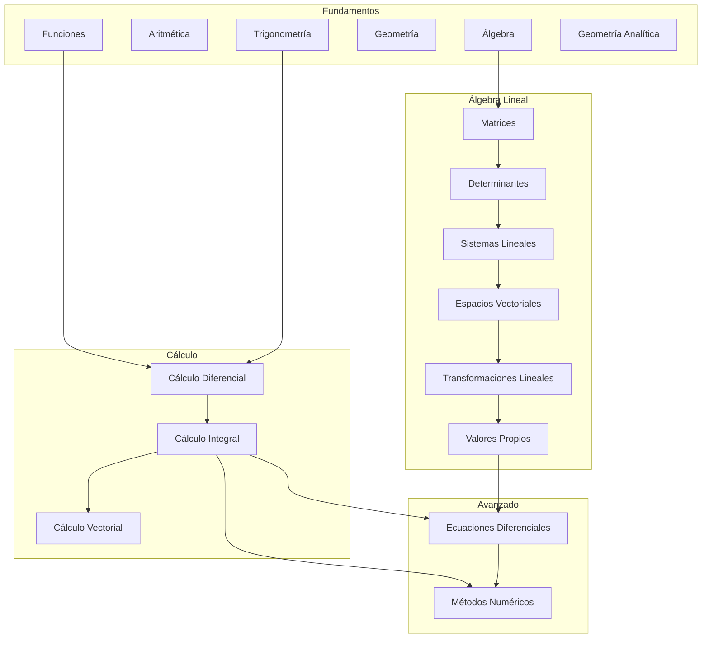

<!--
::METADATA::
type: index
topic_id: repo-readme
file_id: README
status: stable
audience: student
last_updated: 2026-01-03
-->

> 🌐 **Navegación:** [🗺️ Wiki Index - Mapa del Repositorio](WIKI_INDEX.md) | [📖 Glosario](glossary.md) | [📚 Biblioteca](00-META/bibliografia-general.md)

---

# Repositorio de Matemáticas Universitarias

## 🌱 Jardín Digital Interconectado

Este repositorio ha sido transformado en un **Jardín Digital** estilo Wikipedia, donde:

- 🔗 **Términos enlazados:** La primera mención de cada término del glosario en cada archivo está automáticamente vinculada a su definición
- 🗺️ **Índice Wiki:** Un [mapa de navegación centralizado](WIKI_INDEX.md) para ver todo el contenido organizado
- 📚 **Bibliografía validada:** Todo el contenido ha sido [verificado contra bibliografía estándar universitaria](00-META/bibliografia-general.md)

### Para humanos:
1. Explora desde el [Wiki Index](WIKI_INDEX.md) para encontrar tu tema
2. Consulta el [Glosario](glossary.md) para definiciones de términos
3. Revisa la [Biblioteca Central](00-META/bibliografia-general.md) para referencias bibliográficas

### Para IA (Copilot/Agentes):
1. **Lee primero [`.ai-bootstrap.md`](.ai-bootstrap.md)** — Punto de entrada obligatorio
2. Consulta [00-META/ia-contract.md](00-META/ia-contract.md) para reglas globales
3. Respeta la nomenclatura: `[PREFIJO]-[XX]-[Contenido].md`
4. Usa el `manifest.json` de cada tema para ubicar recursos
5. Los términos del glosario están auto-vinculados en el contenido

## Módulos disponibles

| Módulo | Prefijo | Descripción | Subtemas | Estado | Bibliografía |
|--------|---------|-------------|:--------:|:------:|--------------|
| [01-Fundamentos](01-Fundamentos/00-Index.md) | `FUN` | Aritmética, álgebra, geometría, trigonometría | 6 | ✅ | Baldor, Sullivan, Swokowski |
| [02-Álgebra Lineal](02-Algebra-Lineal/00-Index.md) | `AL` | Matrices, espacios vectoriales, eigenvalores | 6 | ✅ | Grossman, Lay, Strang |
| [03-Cálculo Diferencial](03-Calculo-Diferencial/00-Index.md) | `CD` | Límites, derivadas, aplicaciones | 4 | ✅ | Stewart, Larson, Thomas |
| [04-Cálculo Integral](04-Calculo-Integral/00-Index.md) | `CI` | Integrales, técnicas, aplicaciones | 5 | ✅ | Stewart, Larson, Thomas |
| [05-Cálculo Vectorial](05-Calculo-Vectorial/00-Index.md) | `CV` | Vectores, funciones varias variables | 5 | ✅ | Stewart, Marsden, Thomas |
| [06-Ecuaciones Diferenciales](06-Ecuaciones-Diferenciales/00-Index.md) | `ED` | EDO, sistemas, Laplace, series | 5 | ✅ | Zill, Boyce, Nagle |
| [07-Métodos Numéricos](07-Metodos-Numericos/00-Index.md) | `MN` | Raíces, interpolación, integración | 4 | ✅ | Burden, Chapra, Mathews |

## Skill tree (Mapa de dependencias)

## Referencias rápidas

| Recurso | Descripción |
|---------|-------------|
| [🤖 AI Bootstrap](.ai-bootstrap.md) | **Punto de entrada para IAs** — Leer primero |
| [🗺️ Wiki Index](WIKI_INDEX.md) | Mapa de navegación centralizado |
| [📚 Biblioteca Central](00-META/bibliografia-general.md) | Referencias bibliográficas validadas |
| [📖 Glosario](glossary.md) | ~130 términos con analogías (auto-vinculado) |
| [Guía de estudio](00-META/study-guide.md) | Cómo usar el repositorio |
| [Notación](00-META/notation-cheatsheet.md) | Símbolos y convenciones |
| [Contrato IA](00-META/ia-contract.md) | Directivas para asistentes IA |
| [Auditoría META](00-META/audit-meta-files.md) | Mapa de archivos de configuración |
| [Validador](00-META/tools/validate_repo.py) | Verificar integridad |

## 📦 Gestión de Archivos Grandes (Git LFS)

Este repositorio utiliza **Git LFS (Large File Storage)** para gestionar archivos de imagen (`.png`, `.svg`, `.jpg`, etc.) y otros binarios pesados. Esto mantiene el historial de Git ligero y rápido.

- 📘 **Protocolo Detallado:** [Protocolo de Migración y Mantenimiento LFS](00-META/protocolo-lfs.md)

### Para usuarios:
Si clonas el repositorio y las imágenes no son visibles (aparecen como archivos de texto pequeños):
1. Instala Git LFS: `git lfs install`
2. Descarga las imágenes: `git lfs pull`

## 📝 Carpetas Notas — Sandbox Personal

Cada subtema incluye una carpeta `Notas/` para contenido sin clasificar:

| Característica | Descripción |
|----------------|-------------|
| **Propósito** | Espacio sandbox para notas, borradores y experimentos |
| **Reglas** | ❌ **NINGUNA** — Exento de todas las normativas |
| **Contenido** | Texto, multimedia, código, archivos externos |
| **Ubicación** | `XX-Modulo/XX-Subtema/Notas/` |

> **Para IA:** Las carpetas `Notas/` son zonas de excepción total. No aplicar validación ni sugerir correcciones.

---

*Última actualización: 2026-01-05* — **Auditoría bibliográfica completa:** 35 subtemas validados contra bibliografía estándar universitaria.
