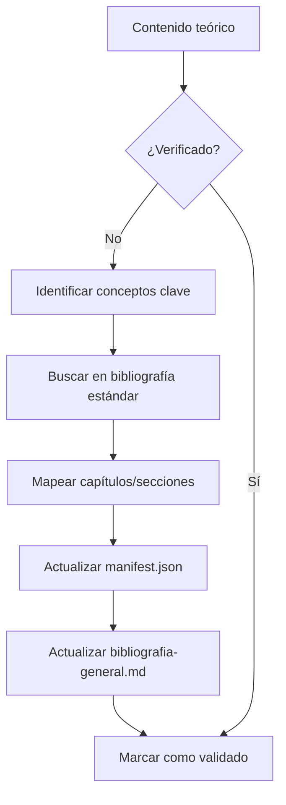

# 📐 Guía de Arquitectura del Repositorio de Matemáticas

> **Propósito:** Documentación completa de la estructura, convenciones y arquitectura modular del repositorio de Matemáticas. Diseñado como referencia técnica para entender el funcionamiento de cada componente.

---

## 📋 DESCRIPCIÓN GENERAL

Este repositorio implementa el patrón **"Digital Garden"** para organizar conocimiento matemático de forma progresiva, navegable y validada bibliográficamente.

### Principios de Diseño

1. **Progresión natural:** Desde fundamentos hasta temas avanzados
2. **Modularidad:** Cada tema es una unidad autónoma con estructura consistente
3. **Doble audiencia:** Navegable por humanos (estudiantes) e interpretable por IA
4. **Validación bibliográfica:** Todo contenido respaldado por fuentes académicas estándar
5. **Sistema de soluciones multinivel:** Respuestas rápidas y desarrollos completos

---

## 🧬 ANATOMÍA DEL REPOSITORIO

### Nivel 0 — Raíz del Repositorio

```
MATEMATICAS-GITHUB/
├── README.md                        # Entrada principal con skill tree visual
├── WIKI_INDEX.md                    # Índice central de navegación por módulos
├── glossary.md                      # ~150 términos matemáticos definidos
├── TEMPLATE_GUIA_NUEVO_REPOSITORIO.md  # Este archivo (guía de arquitectura)
├── AUDITORIA_ESTADO_REPO.md         # Estado actual y auditoría del repositorio
│
├── 00-META/                         # 🎛️ CENTRO DE CONTROL (configuración global)
│   ├── ia-contract.md               # Directivas globales para asistentes IA
│   ├── bibliografia-general.md      # Biblioteca central de referencias
│   ├── nomenclatura-estandar.md     # Reglas de nombrado de archivos
│   ├── notation-cheatsheet.md       # Símbolos LaTeX y convenciones
│   ├── study-guide.md               # Guía de estudio para estudiantes
│   ├── directory-tree.md            # Árbol de directorios actualizado
│   ├── audit-file-list.md           # Lista de archivos para auditoría
│   ├── audit-table-issues.md        # Registro de issues encontrados
│   ├── prompts-for-students.md      # Prompts útiles para estudiantes
│   ├── plantilla-respuestas.md      # Plantilla para formato de respuestas
│   └── tools/                       # Scripts de validación
│       ├── validate_repo.py         # Verificador de integridad
│       ├── check_tables.py          # Validador de tablas Markdown
│       └── link_knowledge_base.py   # Auto-vinculador al glosario
│
├── 01-Fundamentos/                  # Módulo 1: Fundamentos matemáticos
├── 02-Algebra-Lineal/               # Módulo 2: Álgebra Lineal
├── 03-Calculo-Diferencial/          # Módulo 3: Cálculo Diferencial
├── 04-Calculo-Integral/             # Módulo 4: Cálculo Integral
├── 05-Calculo-Vectorial/            # Módulo 5: Cálculo Vectorial
├── 06-Ecuaciones-Diferenciales/     # Módulo 6: Ecuaciones Diferenciales
└── 07-Metodos-Numericos/            # Módulo 7: Métodos Numéricos
```

---

## 📂 ESTRUCTURA DE MÓDULOS

### Nivel 1 — Módulo Principal

Cada módulo corresponde a una asignatura o área matemática completa.

```
XX-Nombre-Modulo/
├── 00-Index.md                      # Índice del módulo con tabla de temas
├── 01-[Subtema-1]/                  # Primer subtema
├── 02-[Subtema-2]/                  # Subtemas en orden progresivo
├── ...
└── NN-[Subtema-N]/                  # Último subtema del módulo
```

#### Función de `00-Index.md`

| Elemento | Descripción |
|----------|-------------|
| **Header de navegación** | Enlaces a WIKI_INDEX y glossary |
| **Descripción del módulo** | Resumen del contenido y objetivos |
| **Tabla de temas** | Lista numerada con enlaces a cada subtema |
| **Prerequisitos** | Conocimientos previos necesarios |
| **Conexiones** | Relación con otros módulos |

**Ejemplo real de** [01-Fundamentos/00-Index.md](01-Fundamentos/00-Index.md):

```markdown
## Temas del módulo

| # | Tema | Descripción |
|---|------|-------------|
| 1 | [01-Simbología Matemática](./01-Simbologia-Matematica/FUN-01-Simbologia-Intro.md) | Símbolos y notación |
| 2 | [02-Aritmética](./02-Aritmetica/FUN-02-Aritmetica-Intro.md) | Operaciones básicas |
| 3 | [03-Álgebra](./03-Algebra/FUN-03-Algebra-Intro.md) | Expresiones y ecuaciones |
...
```

---

### Nivel 2 — Subtema (Unidad Atómica de Aprendizaje)

Cada subtema es una **unidad completa y autónoma** con todos los recursos necesarios para dominar un tema específico.

```
XX-Nombre-Subtema/
│
├── 📋 ARCHIVOS DE CONFIGURACIÓN
│   ├── manifest.json                # ⚙️ CONTRATO CENTRAL: metadatos, recursos, bibliografía
│   └── _directives.md               # 🤖 Instrucciones específicas para IA
│
├── 📚 ARCHIVOS DE CONTENIDO PRINCIPAL
│   ├── PREFIJO-XX-Subtema-Intro.md  # 🚀 PUNTO DE ENTRADA (obligatorio)
│   └── PREFIJO-XX-Resumen-Formulas.md # 📝 Cheat sheet / Quick reference
│
├── 📖 CARPETAS DE CONTENIDO
│   ├── theory/                      # 📐 Teoría: definiciones, teoremas, demostraciones
│   │   └── PREFIJO-XX-Teoria-*.md
│   │
│   ├── methods/                     # 🔧 Métodos: procedimientos paso a paso
│   │   └── PREFIJO-XX-Metodos-*.md
│   │
│   ├── problems/                    # ✏️ Problemas: enunciados de ejercicios
│   │   └── PREFIJO-XX-Problemas.md
│   │
│   └── solutions/                   # ✅ Soluciones: sistema de 3 niveles
│       ├── PREFIJO-XX-Respuestas.md       # Nivel 1: respuestas rápidas
│       ├── PREFIJO-XX-Soluciones-Desarrolladas.md  # Nivel 2: desarrollo general
│       └── prob-XX/                       # Nivel 3: soluciones individuales
│           └── solucion-metodo.md
│
└── 📁 CARPETAS OPCIONALES
    ├── applications/                # 🌍 Aplicaciones: casos de uso reales
    ├── diagnostic/                  # 🩺 Diagnóstico: evaluaciones iniciales
    └── media/                       # 🖼️ Media: imágenes, diagramas, gráficos
```

---

## � FUNCIÓN DETALLADA DE CADA ARCHIVO

### 1. `manifest.json` — El Contrato Central del Subtema

El `manifest.json` es el **archivo más importante** de cada subtema. Actúa como:
- **Mapa de recursos:** Indica dónde está cada archivo
- **Contrato IA:** Define comportamiento esperado del asistente
- **Registro bibliográfico:** Documenta fuentes de validación
- **Metadatos:** Información de estado, dificultad, tiempo estimado

#### Estructura Completa con Explicación

```json
{
  // === IDENTIFICACIÓN ===
  "id": "fun-02-aritmetica",          // ID único del subtema (prefijo-número-nombre)
  "topic": "Aritmética",              // Nombre legible del tema
  "type": "learning_module",          // Tipo: learning_module | reference_library
  "status": "active",                 // Estado: active | draft | deprecated
  "last_updated": "2024-12-23",       // Última modificación (YYYY-MM-DD)
  
  // === PROPÓSITO Y CLASIFICACIÓN ===
  "human_purpose": "Dominar operaciones numéricas básicas...",  // Descripción para humanos
  "tags": ["numeros", "operaciones", "fracciones"],             // Etiquetas de búsqueda
  "skill_nodes": ["aritmetica:operaciones-basicas"],            // Nodos del skill tree
  "difficulty": "básico",             // básico | intermedio | avanzado
  "estimated_time": "4-6 horas",      // Tiempo estimado de estudio
  
  // === MAPA DE RECURSOS (resource_map) ===
  "resource_map": {
    "entry_point": "FUN-02-Aritmetica-Intro.md",           // Archivo de entrada
    "main_theory": "theory/FUN-02-Teoria-Aritmetica.md",   // Teoría principal
    "cheat_sheet": "FUN-02-Resumen-Formulas.md",           // Hoja de referencia
    "methods": ["methods/FUN-02-Metodos-Aritmetica.md"],   // Lista de métodos
    "problems": ["problems/FUN-02-Problemas.md"],          // Lista de problemas
    "answers": "solutions/FUN-02-Respuestas.md",           // Respuestas rápidas
    "solutions": ["solutions/FUN-02-Soluciones-Desarrolladas.md"]  // Desarrollos
  },
  
  // === SUBTEMAS INTERNOS ===
  "subtopics": [
    {"id": "2.1", "title": "Sistemas numéricos", "concepts": ["ℕ", "ℤ", "ℚ", "ℝ"]},
    {"id": "2.2", "title": "Operaciones fundamentales", "concepts": ["Suma", "Resta", ...]},
    {"id": "2.3", "title": "Divisibilidad y primos", "concepts": ["Criterios", "Factorización"]}
    // ... más subtemas
  ],
  
  // === CONTRATO IA (ai_contract) ===
  "ai_contract": {
    "default_output": "markdown",                          // Formato de salida
    "allowed_tasks": [                                     // Tareas permitidas
      "explain_concept",    // Explicar conceptos
      "generate_problems",  // Generar problemas nuevos
      "convert_format",     // Convertir formatos
      "verify_solution",    // Verificar soluciones del estudiante
      "diagnostic_check"    // Evaluación diagnóstica
    ],
    "solution_guidelines": {
      "require_context": true,        // Siempre dar contexto antes de resolver
      "step_by_step": true,           // Mostrar pasos intermedios
      "didactic_tone": "Guía al estudiante como tutor personal"
    }
  },
  
  // === VALIDACIÓN BIBLIOGRÁFICA ===
  "references": [
    {
      "citation": "Baldor, A. (2017). Aritmética. 2ª ed. Patria.",
      "mapping": {
        "Capítulo 1-5": "Sistemas numéricos y operaciones",
        "Capítulo 6-10": "Divisibilidad, MCD, MCM"
      }
    }
  ],
  "validation_status": {
    "validated": true,
    "date": "2024-12-23",
    "validator": "Auditoría bibliográfica",
    "notes": "Contenido verificado contra Baldor y Stewart"
  }
}
```

#### Campos Clave del `resource_map`

| Campo | Descripción | Uso |
|-------|-------------|-----|
| `entry_point` | Archivo de entrada al tema | Primera lectura, orientación |
| `main_theory` | Teoría principal completa | Estudio profundo |
| `cheat_sheet` | Resumen de fórmulas | Repaso rápido, exámenes |
| `methods` | Lista de procedimientos | Aprender técnicas |
| `problems` | Lista de problemas | Práctica |
| `answers` | Respuestas rápidas | Verificación inmediata |
| `solutions` | Desarrollos completos | Aprendizaje del proceso |

---

### 2. `_directives.md` — Instrucciones para IA

Este archivo **hereda** las directivas globales de `00-META/ia-contract.md` y añade instrucciones específicas del subtema.

#### Contenido Típico

```markdown
# Directivas — [Nombre del Tema]

## Clasificación del Contenido

| Carpeta/Archivo | Archivo Principal | Descripción |
|-----------------|-------------------|-------------|
| `theory/` | `PREFIJO-XX-Teoria-*.md` | Teoría completa |
| `methods/` | `PREFIJO-XX-Metodos-*.md` | Procedimientos |
| `problems/` | `PREFIJO-XX-Problemas.md` | Enunciados |
| `solutions/` | `PREFIJO-XX-Respuestas.md` | Soluciones |

## Subtemas (X.1 - X.N)
[Lista de subtemas con descripción]

## Directivas Específicas para IA

- **Audiencia:** Autoestudio universitario
- **Formato de salida:** Markdown con LaTeX
- **Tareas permitidas:** [lista según manifest.json]
- **Al generar soluciones:** Incluir contexto explicando el método

## Notas de Formato Especiales

- En tablas, usar `\lvert \rvert` para valor absoluto
- Cada problema debe indicar el subtema al que pertenece
- Las soluciones siguen el formato: `**N)** *Contexto: [explicación]*`
```

---

### 3. `PREFIJO-XX-*-Intro.md` — Punto de Entrada

**El archivo más importante para el estudiante.** Es la puerta de entrada al tema.

#### Estructura Obligatoria

```markdown
<!--
::METADATA::
type: index
topic_id: [id-del-tema]
file_id: [nombre-archivo]
status: stable
audience: student
-->

> 🏠 **Navegación:** [← Volver al Índice Principal](../../WIKI_INDEX.md) | [📚 Glosario](../../glossary.md)

---

# [Nombre del Tema]

## Propósito del tema
[Párrafo motivacional: ¿Por qué es importante este tema?]

## Mapa de recursos
[Diagrama o lista de todos los archivos disponibles]

## Ruta de aprendizaje
[Secuencia recomendada de estudio con enlaces]

## Tabla de fórmulas clave
[Resumen visual de las fórmulas más importantes]
```

#### Función Pedagógica

| Sección | Propósito |
|---------|-----------|
| **Propósito** | Motivar al estudiante, conectar con aplicaciones |
| **Mapa de recursos** | Orientar sobre qué archivos existen y para qué |
| **Ruta de aprendizaje** | Guiar la secuencia de estudio |
| **Fórmulas clave** | Preview del contenido, referencia rápida |

---

### 4. `PREFIJO-XX-Resumen-Formulas.md` — Cheat Sheet

**Hoja de referencia rápida** diseñada para:
- Repaso antes de exámenes
- Consulta durante resolución de problemas
- Resumen ejecutivo del tema

#### Estructura Típica

```markdown
<!--
::METADATA::
type: cheatsheet
audience: exam_review
-->

# Resumen rápido — [Tema]

## [Sección 1: Concepto principal]
[Fórmulas en LaTeX organizadas en tablas]

## [Sección 2: Otro concepto]
| Operación | Fórmula |
|-----------|---------|
| Suma | $a + b$ |
| Producto | $a \cdot b$ |

## [Sección N]
...

---
<!-- IA: Hoja de referencia. Para desarrollo: [enlace a teoría] -->
```

---

### 5. `theory/PREFIJO-XX-Teoria-*.md` — Teoría Completa

**Desarrollo teórico completo** del tema. Incluye:

| Elemento | Descripción |
|----------|-------------|
| **Definiciones** | Conceptos fundamentales con rigor matemático |
| **Teoremas** | Enunciados formales con demostraciones cuando aplique |
| **Propiedades** | Características importantes derivadas |
| **Ejemplos** | Ilustraciones de cada concepto |
| **Observaciones** | Notas importantes, casos especiales |
| **Errores comunes** | Advertencias sobre confusiones frecuentes |

#### Convenciones de Formato

- Definiciones en **negrita** o en bloques `> `
- Teoremas numerados: `### Teorema X.Y: Nombre`
- Demostraciones en bloques colapsables `<details>`
- Fórmulas importantes en `$$..$$` (display mode)
- Ejemplos numerados: `#### Ejemplo X.Y.Z`

---

### 6. `methods/PREFIJO-XX-Metodos-*.md` — Procedimientos

**Guías paso a paso** para resolver tipos específicos de problemas.

#### Estructura de un Método

```markdown
## Método: [Nombre del Procedimiento]

### Cuándo usar
[Descripción del tipo de problema que resuelve]

### Pasos

1. **Identificar** [qué buscar en el problema]
2. **Aplicar** [fórmula o técnica]
3. **Simplificar** [operaciones intermedias]
4. **Verificar** [comprobación del resultado]

### Ejemplo Resuelto

**Problema:** [Enunciado]

**Solución:**
- Paso 1: ...
- Paso 2: ...
- Resultado: $...$

### Errores Comunes
- ❌ [Error típico]
- ✅ [Forma correcta]
```

---

### 7. `problems/PREFIJO-XX-Problemas.md` — Enunciados

**Colección de problemas** organizados por:
- Subtema (2.1, 2.2, etc.)
- Dificultad (⭐, ⭐⭐, ⭐⭐⭐)

#### Formato de Problema

```markdown
### Prob-XX
**[Subtema X.Y]** ⭐⭐

[Enunciado completo del problema]

> 💡 [Pista opcional]

📝 [Solución →](../solutions/PREFIJO-XX-Respuestas.md#prob-xx)
```

---

### 8. `solutions/` — Sistema de Soluciones de 3 Niveles

#### Arquitectura del Sistema

```
solutions/
├── PREFIJO-XX-Respuestas.md              # Nivel 1: Respuestas rápidas
├── PREFIJO-XX-Soluciones-Desarrolladas.md # Nivel 2: Desarrollos generales
└── prob-XX/                              # Nivel 3: Soluciones individuales
    └── solucion-metodo.md
```

#### Nivel 1: `Respuestas.md` — Respuestas Rápidas

Para verificación inmediata sin ver el proceso.

```markdown
## Respuestas Rápidas

| Prob | Respuesta | Desarrollo |
|------|-----------|------------|
| 01 | $x = 5$ | — |
| 02 | $42$ | [Ver →](prob-02/solucion-metodo.md) |
| 03 | $\frac{3}{4}$ | — |
```

#### Nivel 2: `Soluciones-Desarrolladas.md` — Desarrollos

Soluciones con contexto y pasos intermedios.

```markdown
## Soluciones Desarrolladas

### Prob-01
**Contexto:** Este problema aplica [concepto X] porque [razón].

**Solución:**
$$\text{Paso 1: } ...$$
$$\text{Paso 2: } ...$$

**Respuesta:** $x = 5$
```

#### Nivel 3: `prob-XX/solucion-metodo.md` — Soluciones Individuales

Para problemas complejos que requieren explicación extensa.

```markdown
# Solución — Problema XX

## Enunciado
[Copia del problema]

## Análisis
[¿Qué tipo de problema es? ¿Qué método aplica?]

## Solución Paso a Paso

### Paso 1: [Título]
[Desarrollo con explicación]

### Paso 2: [Título]
[Desarrollo con explicación]

## Respuesta Final
**R:** $...$

## Verificación
[Comprobación del resultado]
```

---

### 9. Carpetas Opcionales

#### `applications/` — Aplicaciones Reales

Conexiones del tema con el mundo real o con otras disciplinas.

```markdown
# Aplicaciones de [Tema]

## Aplicación 1: [Campo]
[Descripción de cómo se usa el concepto]

## Aplicación 2: [Campo]
[Otro ejemplo de aplicación]
```

#### `diagnostic/` — Evaluaciones Diagnósticas

Tests iniciales para que el estudiante evalúe su nivel.

```markdown
# Diagnóstico — [Tema]

## Instrucciones
Responde las siguientes preguntas sin consultar material.
Tiempo sugerido: 15 minutos.

## Preguntas

### 1. [Pregunta básica]
...

## Autoevaluación
- 0-3 correctas: Revisar prerequisitos
- 4-6 correctas: Comenzar por teoría
- 7-10 correctas: Ir directo a problemas
```

#### `media/` — Recursos Visuales

Imágenes, diagramas, gráficos referenciados desde otros archivos.

```
media/
├── diagrama-concepto.png
├── grafico-funcion.svg
└── tabla-valores.png
```

---

## 🏷️ SISTEMA DE PREFIJOS Y NOMENCLATURA

### Prefijos por Módulo

| Módulo | Prefijo | Ejemplo de Archivo |
|--------|---------|-------------------|
| 01-Fundamentos | `FUN` | `FUN-02-Aritmetica-Intro.md` |
| 02-Algebra-Lineal | `AL` | `AL-01-Matrices-Intro.md` |
| 03-Calculo-Diferencial | `CD` | `CD-02-Derivadas-Intro.md` |
| 04-Calculo-Integral | `CI` | `CI-03-Integral-Definida-Intro.md` |
| 05-Calculo-Vectorial | `CV` | `CV-04-Varias-Variables-Intro.md` |
| 06-Ecuaciones-Diferenciales | `ED` | `ED-01-EDO-Primer-Orden-Intro.md` |
| 07-Metodos-Numericos | `MN` | `MN-02-Interpolacion-Intro.md` |

### Patrón de Nombres

```
[PREFIJO]-[XX]-[Contenido]-[Tipo].md

Donde:
- PREFIJO: 2-3 letras del módulo (FUN, AL, CD, CI, CV, ED, MN)
- XX: Número del subtema dentro del módulo (01, 02, ...)
- Contenido: Nombre descriptivo en PascalCase
- Tipo: Teoria, Metodos, Problemas, Respuestas, Intro, Resumen-Formulas
```

### Excepciones al Estándar

| Excepción | Ubicación | Razón |
|-----------|-----------|-------|
| `00-Index.md` | Cada módulo | Archivo índice estándar |
| `solucion-*.md` | `solutions/prob-XX/` | Contexto implícito por carpeta |
| Archivos en `01-Simbologia-Matematica/theory/` | `01-Fundamentos/` | Material de consulta sin secuencia |
| Archivos en `00-META/` | Raíz | Configuración global |

---

## 🔗 SISTEMA DE ENLACES

### Tipos de Enlaces

| Tipo | Sintaxis | Ejemplo |
|------|----------|---------|
| Mismo directorio | `[texto](archivo.md)` | `[Intro](FUN-02-Intro.md)` |
| Subdirectorio | `[texto](carpeta/archivo.md)` | `[Teoría](theory/FUN-02-Teoria.md)` |
| Directorio padre | `[texto](../archivo.md)` | `[Índice](../00-Index.md)` |
| Al glosario | `[término](../glossary.md#ancla)` | `[función](../glossary.md#funcion)` |
| Entre módulos | `[texto](../Modulo/archivo.md)` | `[Matrices](../02-Algebra-Lineal/01-Matrices/)` |

### Header de Navegación Estándar

Todo archivo de contenido debe incluir:

```markdown
> 🏠 **Navegación:** [← Volver al Índice Principal](../../WIKI_INDEX.md) | [📚 Glosario](../../glossary.md)
```

Ajustar la profundidad de `../` según ubicación del archivo.

---

## 🎛️ INTEGRACIÓN CON 00-META

### Flujo de Datos: Módulos ↔ 00-META

```
                                   00-META/
┌────────────────────────────────────────────────────────────────────┐
│  ia-contract.md         → Directivas globales para toda IA        │
│  nomenclatura-estandar.md → Reglas de nombrado de archivos        │
│  notation-cheatsheet.md → Símbolos LaTeX estándar                 │
│  bibliografia-general.md → BIBLIOTECA CENTRAL (maestro)           │
└────────────────────────────────────────────────────────────────────┘
         ▲                    ▲                    ▲
         │ Hereda directivas  │ Consulta símbolos  │ Registra validación
         │                    │                    │
┌────────┴────────┐  ┌────────┴────────┐  ┌───────┴─────────┐
│ XX-Subtema/     │  │ XX-Subtema/     │  │ XX-Subtema/     │
│ _directives.md  │  │ theory/*.md     │  │ manifest.json   │
│ (hereda de      │  │ (usa notación   │  │ (references →   │
│  ia-contract)   │  │  estándar)      │  │  biblioteca)    │
└─────────────────┘  └─────────────────┘  └─────────────────┘
```

### Archivos de Control en 00-META

| Archivo | Propósito | Consumido por |
|---------|-----------|---------------|
| `ia-contract.md` | Directivas globales para IA | `_directives.md` de cada subtema |
| `nomenclatura-estandar.md` | Convenciones de nombrado | Toda creación de archivos |
| `notation-cheatsheet.md` | Símbolos LaTeX estándar | Archivos `theory/*.md` |
| `bibliografia-general.md` | Registro maestro de referencias | `manifest.json` de cada subtema |
| `study-guide.md` | Guía de estudio | Estudiantes, README |
| `tools/*.py` | Scripts de validación | CI/CD, auditorías manuales |

---

## 📊 SISTEMA DE SOLUCIONES MULTINIVEL

### Diagrama de Decisión

```
ESTUDIANTE BUSCA SOLUCIÓN
           │
           ▼
    ¿Solo verificar respuesta?
           │
    ┌──────┴──────┐
    │ SÍ          │ NO
    ▼             ▼
Respuestas.md   ¿Necesita explicación detallada?
(tabla rápida)    │
                  ├──────────────┐
                  │ BÁSICA       │ EXTENSA
                  ▼              ▼
    Soluciones-Desarrolladas   prob-XX/
    (desarrollo en contexto)   solucion-metodo.md
                               (página completa)
```

### Cuándo Crear Cada Nivel

| Nivel | Cuándo Crear | Contenido |
|-------|--------------|-----------|
| **Respuestas.md** | SIEMPRE | Todas las respuestas finales |
| **Soluciones-Desarrolladas.md** | Cuando hay ≥10 problemas | Desarrollos con contexto |
| **prob-XX/** | Para problemas complejos | Explicación paso a paso extensa |

---

## 📚 VALIDACIÓN BIBLIOGRÁFICA

### Proceso de Validación



### Bibliografía Estándar del Repositorio

| Área | Autor Principal | Título |
|------|-----------------|--------|
| Aritmética/Álgebra | Baldor, A. | *Aritmética* / *Álgebra* |
| Cálculo | Stewart, J. | *Cálculo de una variable* / *Multivariable* |
| Álgebra Lineal | Grossman, S. | *Álgebra Lineal* |
| Ecuaciones Diferenciales | Zill, D. | *Ecuaciones Diferenciales* |
| Métodos Numéricos | Burden & Faires | *Análisis Numérico* |

---

## ✅ BLOQUE ::METADATA:: EN ARCHIVOS .MD

Todo archivo `.md` debe comenzar con:

```markdown
<!--
::METADATA::
type: [theory | method | problem | solution | reference | index | cheatsheet | answer-key]
topic_id: [id-del-tema]
file_id: [nombre-archivo-sin-extension]
status: [draft | review | stable | active]
audience: [student | ai_context | both | exam_review]
last_updated: YYYY-MM-DD
-->
```

### Tipos de Archivo

| type | Descripción |
|------|-------------|
| `theory` | Desarrollo teórico |
| `method` | Procedimiento paso a paso |
| `problem` | Enunciados de problemas |
| `solution` | Soluciones desarrolladas |
| `reference` | Material de consulta |
| `index` | Índice o punto de entrada |
| `cheatsheet` | Resumen de fórmulas |
| `answer-key` | Tabla de respuestas |

---

## 🗂️ RESUMEN: MÓDULOS DEL REPOSITORIO

| # | Prefijo | Módulo | Subtemas |
|---|---------|--------|----------|
| 01 | `FUN` | **Fundamentos** | Simbología, Aritmética, Álgebra, Geometría, Trigonometría, Geometría Analítica |
| 02 | `AL` | **Álgebra Lineal** | Matrices, Determinantes, Sistemas Lineales, Espacios Vectoriales, Transformaciones, Valores Propios |
| 03 | `CD` | **Cálculo Diferencial** | Límites, Derivadas, Aplicaciones, Teoremas Fundamentales |
| 04 | `CI` | **Cálculo Integral** | Integral Indefinida, Técnicas, Integral Definida, Aplicaciones, Impropias |
| 05 | `CV` | **Cálculo Vectorial** | Vectores, Curvas, Funciones Vectoriales, Varias Variables, Integración Múltiple |
| 06 | `ED` | **Ecuaciones Diferenciales** | EDO Primer Orden, Segundo Orden, Sistemas, Laplace, Series de Potencias |
| 07 | `MN` | **Métodos Numéricos** | Raíces, Interpolación, Integración Numérica, EDO Numéricas |

---

**Última actualización:** 2026-01-05  
**Versión:** 4.0 — Documentación específica del Repositorio de Matemáticas  
**Estado:** 7 módulos completos, ~35 subtemas validados bibliográficamente
