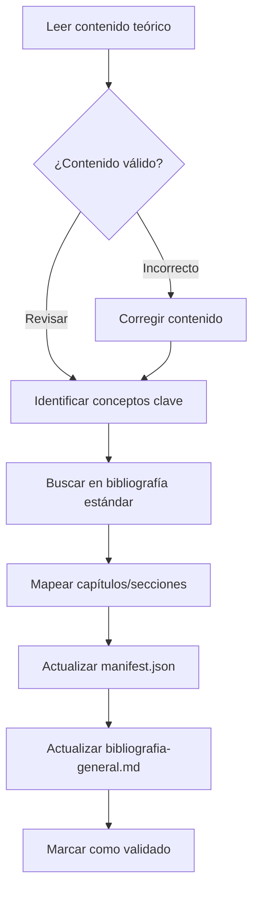

# 🏗️ Plantilla para Crear Repositorios de Conocimiento Estructurado

> **Propósito:** Esta guía abstrae los patrones exitosos del repositorio de Matemáticas para replicarlos en nuevos dominios de conocimiento. Está diseñada como un prompt conceptual para IA o como referencia para humanos.

---

## 📋 PROMPT MAESTRO PARA CREAR NUEVO REPOSITORIO

```markdown
Eres un arquitecto de repositorios de conocimiento. Tu tarea es diseñar la estructura
completa para un repositorio educativo sobre [DOMINIO] siguiendo el patrón "Digital Garden".

El repositorio debe:
1. Organizar conocimiento de manera progresiva (de básico a avanzado)
2. Incluir teoría, métodos prácticos, problemas y soluciones
3. Ser navegable tanto por humanos como por IA
4. Mantener consistencia en nomenclatura y formato
5. Usar Markdown con soporte para LaTeX/código según el dominio
```

---

## 🧬 ANATOMÍA DEL REPOSITORIO

### Nivel 0 — Raíz

```
NOMBRE-REPOSITORIO/
├── README.md                        ← Entrada principal, skill tree visual
├── WIKI_INDEX.md                    ← Índice central de navegación
├── glossary.md                      ← ~100-150 términos con definiciones
├── 00-META/                         ← Configuración, bibliografía y guías del repositorio
│   ├── ia-contract.md               ← Directivas globales para IA
│   ├── bibliografia-general.md     ← 📚 BIBLIOTECA CENTRAL (validación bibliográfica)
│   ├── nomenclatura-estandar.md    ← Reglas de nombrado de archivos
│   ├── notation-cheatsheet.md      ← Símbolos y convenciones
│   ├── study-guide.md              ← Guía de estudio para alumnos
│   └── tools/                       ← Scripts de utilidad
│       ├── validate_repo.py         ← Verificador de integridad
│       └── link_knowledge_base.py   ← Auto-vinculador al glosario
├── 01-[Módulo-Básico]/              ← Primer módulo (fundamentos)
├── 02-[Módulo-Intermedio]/          ← Módulos progresivos...
├── ...
└── NN-[Módulo-Avanzado]/            ← Último módulo
```

### Nivel 1 — Módulo

```
XX-Nombre-Modulo/
├── 00-Index.md                      ← Visión general del módulo
├── 01-[Subtema-1]/                  ← Primer subtema
├── 02-[Subtema-2]/                  ← Subtemas progresivos
├── ...
└── NN-[Subtema-N]/
```

### Nivel 2 — Subtema (unidad atómica)

```
XX-Nombre-Subtema/
├── manifest.json                    ← OBLIGATORIO: Metadatos del tema
├── _directives.md                   ← Instrucciones para IA
├── PREFIJO-XX-Subtema-Intro.md      ← 🚀 PUNTO DE ENTRADA
├── PREFIJO-XX-Resumen-Formulas.md   ← Cheat sheet / quick reference
├── theory/                          ← Conceptos, definiciones, teoremas
│   └── PREFIJO-XX-Teoria-*.md
├── methods/                         ← Procedimientos paso a paso
│   └── PREFIJO-XX-Metodos-*.md
├── problems/                        ← Enunciados de ejercicios
│   └── PREFIJO-XX-Problemas.md
├── solutions/                       ← Sistema de 3 niveles
│   ├── PREFIJO-XX-Respuestas.md     ← Nivel 1: Respuestas rápidas
│   ├── prob-04/                     ← Nivel 2: Soluciones desarrolladas
│   │   └── solucion-metodo.md
│   └── prob-XX/
├── applications/                    ← (Opcional) Casos de uso reales
└── media/                           ← (Opcional) Imágenes, diagramas
```

---

## 📁 ARCHIVOS CLAVE Y SUS ESTRUCTURAS

### 1. `manifest.json` — Contrato del subtema

El manifest.json es el **contrato central** de cada subtema. Define recursos, objetivos y **validación bibliográfica**.

```json
{
  "id": "prefijo-xx-nombre",
  "topic": "Título del Tema",
  "type": "learning_module",
  "status": "active",
  "last_updated": "YYYY-MM-DD",
  "human_purpose": "Descripción breve del propósito",
  "resource_map": {
    "entry_point": "PREFIJO-XX-Nombre-Intro.md",
    "main_theory": "theory/PREFIJO-XX-Teoria-Nombre.md",
    "cheat_sheet": "PREFIJO-XX-Resumen-Formulas.md",
    "methods": ["methods/PREFIJO-XX-Metodos-Nombre.md"],
    "problems": "problems/PREFIJO-XX-Problemas.md",
    "answers": "solutions/PREFIJO-XX-Respuestas.md",
    "solutions": [
      "solutions/prob-04/",
      "solutions/prob-10/"
    ]
  },
  "ai_contract": {
    "strict_mode": true,
    "expected_inputs": "Descripción de entradas esperadas",
    "expected_outputs": "Descripción de salidas esperadas",
    "verification": "Criterios de verificación de respuestas"
  },
  "prerequisites": ["id-tema-previo"],
  "learning_objectives": [
    "Objetivo de aprendizaje 1",
    "Objetivo de aprendizaje 2"
  ],
  "estimated_time": "X-Y horas",
  "difficulty": "básico|intermedio|avanzado",
  "subtopics": [
    {"id": "X.1", "title": "Subtema 1", "description": "..."},
    {"id": "X.2", "title": "Subtema 2", "description": "..."}
  ],
  "tags": ["tag1", "tag2"],
  
  "references": [
    {
      "citation": "Autor, A. (Año). Título del Libro. Edición. Editorial.",
      "mapping": {
        "Capítulo X": "Tema cubierto",
        "Sección X.Y": "Concepto específico"
      }
    },
    {
      "citation": "Segundo Autor, B. (Año). Otro Libro. Editorial.",
      "mapping": {
        "Chapter X": "Topic covered"
      }
    }
  ],
  "validation_status": {
    "validated": true,
    "date": "YYYY-MM-DD",
    "validator": "Nombre del validador o IA",
    "notes": "Observaciones de la validación"
  }
}
```

#### Campos de Referencias Bibliográficas

| Campo | Descripción | Obligatorio |
|-------|-------------|-------------|
| `references` | Array de objetos con fuentes bibliográficas | ✅ Sí |
| `citation` | Cita completa en formato APA | ✅ Sí |
| `mapping` | Mapeo capítulo/sección → contenido | ✅ Sí |
| `validation_status` | Estado de validación bibliográfica | Recomendado |
| `validated` | Boolean: ¿contenido verificado? | Recomendado |
| `date` | Fecha de última validación | Recomendado |
| `validator` | Quién validó (humano o IA) | Opcional |
| `notes` | Observaciones especiales | Opcional |

### 2. Bloque `::METADATA::` — Encabezado de archivos .md

```markdown
<!--
::METADATA::
type: theory|method|problem|solution|reference
topic_id: prefijo-xx-nombre
file_id: nombre-archivo
status: draft|review|stable
audience: student|ai_context|both
last_updated: YYYY-MM-DD
-->
```

### 3. `glossary.md` — Glosario con auto-enlace

```markdown
# Glosario

## A

### **algoritmo**
> Un conjunto ordenado y finito de instrucciones que permite resolver un problema.
> 
> **Ver también:** [complejidad](#complejidad), [pseudocódigo](#pseudocódigo)
```

### 4. `00-Index.md` — Índice de módulo

```markdown
# [Módulo]: [Título]

## Visión General
Descripción del módulo...

## Temas Incluidos

| # | Tema | Descripción | Dificultad |
|---|------|-------------|------------|
| 01 | [Tema 1](01-Tema/) | Descripción | ⭐ |
| 02 | [Tema 2](02-Tema/) | Descripción | ⭐⭐ |

## Skill Tree
[Diagrama Mermaid mostrando dependencias]

## Ruta de Estudio Recomendada
1. Comenzar con...
2. Luego estudiar...
```

---

## 🏷️ SISTEMA DE PREFIJOS

| Prefijo | Descripción | Ejemplo de Archivo |
|---------|-------------|-------------------|
| `XX-NN` | Módulo-Subtema | `02-03` = Módulo 2, Subtema 3 |
| `PREFIJO` | Abreviatura del módulo (2-3 letras) | `AL`, `CD`, `VHDL` |

**Convención de nombres:** `PREFIJO-NN-Contenido-Tipo.md`
- Ejemplo: `VHDL-02-Combinacional-Teoria.md`

---

## 🔗 SISTEMA DE ENLACES

### Tipos de enlaces

1. **Internos al subtema:** `[texto](archivo.md)` o `[texto](carpeta/archivo.md)`
2. **Entre subtemas:** `[texto](../XX-Otro-Tema/archivo.md)`
3. **Al glosario:** `[término](../glossary.md#término)`
4. **A soluciones:**
   - Respuesta rápida: `[Solución](#prob-XX)` → enlaza a `Respuestas.md#prob-XX`
   - Solución desarrollada: `[Solución](solutions/prob-XX/solucion-metodo.md)`

### Reglas críticas

- ✅ Usar rutas relativas siempre
- ✅ Anclas en minúsculas con guiones: `#prob-04`, `#definicion`
- ✅ Sin espacios en nombres de archivo
- ❌ No usar rutas absolutas
- ❌ No usar `./` al inicio (redundante)

---

## �️ INTEGRACIÓN 00-META CON MÓDULOS

El directorio `00-META/` actúa como **centro de control** del repositorio. Define estándares y contiene referencias centralizadas que son consumidas por los módulos.

### Flujo de Datos: Módulos ↔ 00-META

```
                                   00-META/
┌────────────────────────────────────────────────────────────────────┐
│  ia-contract.md         → Directivas globales para toda IA        │
│  nomenclatura-estandar.md → Reglas de nombrado de archivos        │
│  notation-cheatsheet.md → Símbolos y notación estándar            │
│  bibliografia-general.md → BIBLIOTECA CENTRAL (maestro)           │
└────────────────────────────────────────────────────────────────────┘
         ▲                    ▲                    ▲
         │ Lee directivas     │ Consulta símbolos  │ Registra validación
         │                    │                    │
┌────────┴────────┐  ┌────────┴────────┐  ┌───────┴─────────┐
│ XX-Modulo/      │  │ XX-Modulo/      │  │ XX-Modulo/      │
│ _directives.md  │  │ theory/*.md     │  │ manifest.json   │
│ (hereda de      │  │ (usa notación   │  │ (references →   │
│  ia-contract)   │  │  estándar)      │  │  biblioteca)    │
└─────────────────┘  └─────────────────┘  └─────────────────┘
```

### Archivos de Control en 00-META

| Archivo | Propósito | Consumido por |
|---------|-----------|---------------|
| `ia-contract.md` | Directivas globales para asistentes IA | `_directives.md` de cada subtema |
| `nomenclatura-estandar.md` | Convenciones de nombrado de archivos | Toda creación de archivos nuevos |
| `notation-cheatsheet.md` | Símbolos matemáticos/técnicos | Archivos `theory/*.md` |
| `bibliografia-general.md` | Registro maestro de referencias | `manifest.json` de cada subtema |
| `study-guide.md` | Guía de estudio para alumnos | README.md, WIKI_INDEX.md |
| `tools/*.py` | Scripts de validación y auto-enlace | Proceso de CI/CD o manual |

### Relación: `manifest.json` → `bibliografia-general.md`

```
manifest.json (local)              bibliografia-general.md (central)
┌─────────────────────────┐        ┌─────────────────────────────────┐
│ "references": [         │        │ ## 📐 01. Módulo Básico         │
│   {                     │        │                                 │
│     "citation": "...",  │───────▶│ | Autor | Título | Edición |    │
│     "mapping": {...}    │        │ |-------|--------|---------|    │
│   }                     │        │ | A, B. | Libro  | Xma ed. |    │
│ ]                       │        │                                 │
├─────────────────────────┤        ├─────────────────────────────────┤
│ "validation_status": {  │        │ ## 📊 Registro de Validación    │
│   "validated": true,    │───────▶│ | Subtema | Estado | Fecha |    │
│   "date": "YYYY-MM-DD"  │        │ |---------|--------|-------|    │
│ }                       │        │ | PRE-01  | ✅     | DD/MM |    │
└─────────────────────────┘        └─────────────────────────────────┘
```

### Herencia de Directivas IA

```markdown
<!-- 00-META/ia-contract.md (global) -->
# Contrato IA - Reglas Globales
1. Respeta nomenclatura estándar
2. Usa manifest.json como mapa de recursos
3. Verifica referencias bibliográficas
4. ...

<!-- XX-Modulo/NN-Subtema/_directives.md (local) -->
# Directivas IA — [Subtema]

## Hereda de:
- [Contrato IA Global](../../00-META/ia-contract.md)

## Directivas Específicas:
- En este tema, usar notación [específica]
- Verificar [condiciones particulares]
```

---

## �📊 SISTEMA DE SOLUCIONES (3 NIVELES)

```
PROBLEMA → ¿Tiene solución desarrollada?
    │
    ├── SÍ → Enlace a: solutions/prob-XX/solucion-metodo.md
    │        (Contiene desarrollo paso a paso)
    │
    └── NO → Enlace a: solutions/PREFIJO-XX-Respuestas.md#prob-XX
             (Solo respuesta final)
```

### Estructura de `Respuestas.md`

```markdown
## Respuestas Rápidas

### Prob-01
**Respuesta:** 42

---

### Prob-02
**Respuesta:** x = 5, y = 3

[Ver solución desarrollada →](prob-02/solucion-metodo.md)
```

### Estructura de solución desarrollada

```markdown
# Solución — Problema XX

## Enunciado
[Copiar enunciado del problema]

## Solución

### Paso 1: [Título]
...

### Paso 2: [Título]
...

## Respuesta Final
**R:** ...
```

---

## 📚 SISTEMA DE VALIDACIÓN BIBLIOGRÁFICA

El sistema de validación bibliográfica garantiza que **todo el contenido sintético** (generado o editado por IA/humanos) esté respaldado por **bibliografía estándar universitaria**.

### Arquitectura de Validación

```
┌─────────────────────────────────────────────────────────────────┐
│                    00-META/bibliografia-general.md              │
│                    (BIBLIOTECA CENTRAL)                          │
│  ┌─────────────────────────────────────────────────────────────┐ │
│  │ • Tablas de referencias por módulo                          │ │
│  │ • Mapeo capítulo → subtema                                  │ │
│  │ • Registro de validación (qué, cuándo, quién)               │ │
│  │ • Detalles expandibles por tema (<details>)                 │ │
│  └─────────────────────────────────────────────────────────────┘ │
└─────────────────────────────────────────────────────────────────┘
                              │
         ┌────────────────────┼────────────────────┐
         ▼                    ▼                    ▼
┌─────────────────┐  ┌─────────────────┐  ┌─────────────────┐
│ XX-Modulo/      │  │ YY-Modulo/      │  │ ZZ-Modulo/      │
│ NN-Subtema/     │  │ MM-Subtema/     │  │ PP-Subtema/     │
│ manifest.json   │  │ manifest.json   │  │ manifest.json   │
│                 │  │                 │  │                 │
│ "references": [ │  │ "references": [ │  │ "references": [ │
│   {...},        │  │   {...},        │  │   {...},        │
│   {...}         │  │   {...}         │  │   {...}         │
│ ]               │  │ ]               │  │ ]               │
└─────────────────┘  └─────────────────┘  └─────────────────┘
```

### Estructura de `00-META/bibliografia-general.md`

```markdown
# 📚 Biblioteca Central de Referencia

## 📋 Índice de Contenido
- [01. Módulo Básico](#-01-módulo-básico)
- [02. Módulo Intermedio](#-02-módulo-intermedio)
- ...
- [Registro de Validación por Tema](#-registro-de-validación-por-tema)

---

## 📐 01. Módulo Básico

> **Módulo:** [01-Nombre](../01-Nombre/00-Index.md) | **Estado:** ✅ VALIDADO

| Autor | Título | Edición | Editorial | Enfoque |
|-------|--------|---------|-----------|--------|
| Autor, A. | *Título del Libro* | Xma ed. | Editorial | **Referencia principal** |
| Autor, B. | *Otro Libro* | Yma ed. | Editorial | Complementario |

### 📌 Mapeo por Subtema

| Subtema | Autor A | Autor B |
|---------|---------|--------|
| [PRE-01 Tema](../01-Modulo/01-Tema/) | Cap. 1-3 | Cap. 2 |
| [PRE-02 Tema](../01-Modulo/02-Tema/) | Cap. 4-5 | Cap. 3 |

### 📖 Detalle de Referencias por Tema

<details>
<summary><strong>PRE-01: Tema</strong> (click para expandir)</summary>

**Conceptos cubiertos:** Lista de conceptos principales del tema.

| Libro | Capítulos/Secciones | Relevancia |
|-------|---------------------|------------|
| Autor A | Capítulo X | Descripción de cobertura |
| Autor B | Secciones Y.Z | Complemento específico |

</details>

---

## 📊 Registro de Validación por Tema

| Módulo | Subtema | Estado | Fecha | Fuentes |
|--------|---------|:------:|-------|--------|
| 01-Básico | PRE-01 | ✅ | YYYY-MM-DD | Autor A, Autor B |
| 01-Básico | PRE-02 | ✅ | YYYY-MM-DD | Autor A |
```

### Proceso de Auditoría Bibliográfica



### Checklist de Validación por Subtema

- [ ] Leer `theory/*.md` del subtema
- [ ] Identificar conceptos principales
- [ ] Verificar contra bibliografía estándar del dominio
- [ ] Agregar bloque `references` a `manifest.json`
- [ ] Agregar bloque `validation_status` a `manifest.json`
- [ ] Actualizar `00-META/bibliografia-general.md`:
  - [ ] Agregar entrada en tabla de mapeo
  - [ ] Crear/actualizar `<details>` del subtema
  - [ ] Actualizar tabla de registro de validación

---

## 🎯 EJEMPLO APLICADO: REPOSITORIO "DISEÑO DIGITAL"

### Propuesta de Módulos

| # | Prefijo | Módulo | Descripción |
|---|---------|--------|-------------|
| 01 | `FDD` | **Fundamentos** | Sistemas numéricos, álgebra booleana, compuertas |
| 02 | `LOG` | **Lógica Combinacional** | Mux, demux, decodificadores, sumadores |
| 03 | `SEC` | **Lógica Secuencial** | Flip-flops, registros, contadores, FSM |
| 04 | `VHDL` | **VHDL** | Sintaxis, modelado, simulación, síntesis |
| 05 | `FPGA` | **Implementación FPGA** | Flujo de diseño, constraints, timing |
| 06 | `MCU` | **Microcontroladores** | Arquitectura, periféricos, programación |
| 07 | `PRY` | **Proyectos Integrados** | Proyectos que combinan todo |

### Estructura Ejemplo: Módulo VHDL

```
04-VHDL/
├── 00-Index.md
├── 01-Introduccion-VHDL/
│   ├── manifest.json
│   ├── _directives.md
│   ├── VHDL-01-Intro.md
│   ├── VHDL-01-Resumen-Sintaxis.md
│   ├── theory/
│   │   ├── VHDL-01-Teoria-Historia.md
│   │   └── VHDL-01-Teoria-Conceptos.md
│   ├── methods/
│   │   └── VHDL-01-Metodos-Entorno.md
│   ├── problems/
│   │   └── VHDL-01-Problemas.md
│   └── solutions/
│       ├── VHDL-01-Respuestas.md
│       └── prob-05/
│           └── solucion-codigo.md
├── 02-Modelado-Combinacional/
├── 03-Modelado-Secuencial/
├── 04-Testbenches/
├── 05-Maquinas-Estados/
└── 06-Sintesis/
```

### Ejemplo de `manifest.json` para VHDL (con referencias)

```json
{
  "id": "vhdl-01-introduccion",
  "topic": "Introducción a VHDL",
  "type": "learning_module",
  "status": "active",
  "last_updated": "2025-01-XX",
  "human_purpose": "Fundamentos del lenguaje VHDL: historia, estructura básica, entidades y arquitecturas.",
  "resource_map": {
    "entry_point": "VHDL-01-Intro.md",
    "main_theory": "theory/VHDL-01-Teoria-Conceptos.md",
    "cheat_sheet": "VHDL-01-Resumen-Sintaxis.md",
    "methods": ["methods/VHDL-01-Metodos-Entorno.md"],
    "problems": "problems/VHDL-01-Problemas.md",
    "answers": "solutions/VHDL-01-Respuestas.md",
    "solutions": ["solutions/prob-05/"]
  },
  "ai_contract": {
    "strict_mode": true,
    "expected_inputs": "Código VHDL con entidades y arquitecturas",
    "expected_outputs": "Análisis de sintaxis, correcciones, explicaciones",
    "verification": "Verificar sintaxis VHDL, nombres de entidad/arquitectura, tipos de datos"
  },
  "prerequisites": ["fdd-01-fundamentos", "log-02-combinacional"],
  "learning_objectives": [
    "Comprender la historia y propósito de VHDL",
    "Escribir entidades y arquitecturas básicas",
    "Diferenciar entre modelado estructural y comportamental",
    "Configurar un entorno de desarrollo VHDL"
  ],
  "estimated_time": "3-4 horas",
  "difficulty": "intermedio",
  "subtopics": [
    {"id": "4.1", "title": "Historia de VHDL", "description": "Origen y evolución del lenguaje"},
    {"id": "4.2", "title": "Estructura básica", "description": "Entidad, arquitectura, configuración"},
    {"id": "4.3", "title": "Tipos de datos", "description": "std_logic, std_logic_vector, integer"},
    {"id": "4.4", "title": "Operadores", "description": "Lógicos, aritméticos, relacionales"}
  ],
  "tags": ["vhdl", "hdl", "fpga", "síntesis", "simulación"],
  
  "references": [
    {
      "citation": "Ashenden, P. (2008). The Designer's Guide to VHDL. 3rd ed. Morgan Kaufmann.",
      "mapping": {
        "Chapter 1": "Introduction - History and overview of VHDL",
        "Chapter 2": "Scalar Data Types and Operations",
        "Chapter 3": "Sequential Statements",
        "Section 4.1-4.3": "Entity and Architecture basics"
      }
    },
    {
      "citation": "Pedroni, V. (2010). Circuit Design and Simulation with VHDL. 2nd ed. MIT Press.",
      "mapping": {
        "Part I": "Introductory concepts and data types",
        "Chapter 2": "Code structure (entity, architecture)",
        "Chapter 3": "Data types overview"
      }
    },
    {
      "citation": "Wakerly, J. (2006). Digital Design: Principles and Practices. 4th ed. Pearson.",
      "mapping": {
        "Chapter 4": "Combinational Logic Technologies",
        "Section 4.7": "HDL Introduction",
        "Appendix A": "VHDL Reference"
      }
    }
  ],
  "validation_status": {
    "validated": true,
    "date": "2025-01-XX",
    "validator": "Departamento de Ingeniería",
    "notes": "Contenido verificado contra bibliografía IEEE estándar para cursos de diseño digital"
  }
}
```

### Glosario Sugerido (términos iniciales)

```markdown
# Glosario — Diseño Digital

## A

### **arquitectura (VHDL)**
> Bloque que describe el comportamiento o estructura interna de una entidad.

### **asíncrono**
> Circuito o señal que no depende de una señal de reloj.

## C

### **combinacional**
> Circuito cuya salida depende únicamente de las entradas actuales.

### **constraint**
> Restricción de diseño (timing, ubicación de pines) para síntesis en FPGA.

## E

### **entidad (VHDL)**
> Declaración de la interfaz externa de un módulo: puertos de entrada/salida.

## F

### **flip-flop**
> Elemento de memoria básico que almacena un bit.

### **FSM (Finite State Machine)**
> Máquina de estados finitos: modelo de circuito secuencial con estados discretos.

### **FPGA**
> Field Programmable Gate Array: circuito integrado reconfigurable.

## L

### **latch**
> Elemento de memoria sensible a nivel (no recomendado en diseño síncrono).

## M

### **microcontrolador**
> Circuito integrado que incluye CPU, memoria y periféricos en un solo chip.

## S

### **secuencial**
> Circuito cuya salida depende de las entradas y del estado anterior.

### **síntesis**
> Proceso de convertir código HDL en una implementación de hardware.

## T

### **testbench**
> Módulo de prueba para verificar el comportamiento de un diseño mediante simulación.

## V

### **VHDL**
> VHSIC Hardware Description Language: lenguaje de descripción de hardware.
```

### Bibliografía Estándar Sugerida — Diseño Digital

| Autor | Título | Edición | Enfoque |
|-------|--------|---------|---------|
| Ashenden, P. | *The Designer's Guide to VHDL* | 3rd ed. | **VHDL - Referencia completa** |
| Pedroni, V. | *Circuit Design and Simulation with VHDL* | 2nd ed. | VHDL práctico con ejemplos |
| Wakerly, J. | *Digital Design: Principles and Practices* | 4th ed. | Fundamentos + introducción HDL |
| Brown, S. & Vranesic, Z. | *Fundamentals of Digital Logic with VHDL Design* | 3rd ed. | Lógica digital completa |
| Mano, M. & Ciletti, M. | *Digital Design* | 6th ed. | Diseño digital clásico |
| Tocci, R. | *Digital Systems: Principles and Applications* | 12th ed. | Sistemas digitales aplicados |
| Patterson, D. & Hennessy, J. | *Computer Organization and Design* | 5th ed. | Arquitectura de computadoras |

---

## ✅ CHECKLIST DE IMPLEMENTACIÓN

### Fase 1: Estructura base
- [ ] Crear carpeta raíz del repositorio
- [ ] Crear README.md con skill tree
- [ ] Crear WIKI_INDEX.md vacío (llenar después)
- [ ] Crear glossary.md con ~50 términos iniciales
- [ ] Crear carpeta 00-META/ con archivos base:
  - [ ] `ia-contract.md` — Directivas para IA
  - [ ] `bibliografia-general.md` — Biblioteca central (vacía inicialmente)
  - [ ] `nomenclatura-estandar.md` — Reglas de nombrado
  - [ ] `notation-cheatsheet.md` — Símbolos y convenciones

### Fase 2: Módulos
- [ ] Crear carpetas de módulos (01-XX/ a NN-XX/)
- [ ] Crear 00-Index.md en cada módulo
- [ ] Definir subtemas por módulo
- [ ] Identificar bibliografía estándar por módulo

### Fase 3: Subtemas
- [ ] Crear estructura de carpetas por subtema
- [ ] Crear manifest.json para cada subtema
- [ ] Crear _directives.md para cada subtema
- [ ] Crear archivo *-Intro.md como punto de entrada

### Fase 4: Contenido
- [ ] Poblar archivos de teoría
- [ ] Crear métodos/procedimientos
- [ ] Crear problemas con soluciones
- [ ] Implementar sistema de 3 niveles de soluciones

### Fase 5: Validación Bibliográfica
- [ ] Revisar contenido teórico de cada subtema
- [ ] Verificar conceptos contra bibliografía estándar
- [ ] Agregar bloque `references` a cada manifest.json
- [ ] Agregar bloque `validation_status` a cada manifest.json
- [ ] Actualizar `00-META/bibliografia-general.md`:
  - [ ] Crear tabla de referencias por módulo
  - [ ] Crear mapeo subtema → capítulos
  - [ ] Crear bloques `<details>` por subtema
  - [ ] Crear tabla de registro de validación

### Fase 6: Navegación e Integración
- [ ] Completar WIKI_INDEX.md con todos los enlaces
- [ ] Verificar enlaces internos
- [ ] Agregar auto-enlaces del glosario
- [ ] Verificar enlaces a bibliografía desde README

---

## 🤖 PROMPT PARA INICIAR CREACIÓN DE CONTENIDO

```markdown
Crea el contenido para el subtema [NOMBRE] del módulo [MÓDULO] siguiendo estas directivas:

1. **Punto de entrada** (`*-Intro.md`):
   - Párrafo motivacional (¿por qué es importante?)
   - Objetivos de aprendizaje (lista)
   - Prerequisitos con enlaces
   - Mapa de recursos del tema

2. **Teoría** (`theory/*.md`):
   - Definiciones precisas
   - Teoremas/propiedades con demostración cuando aplique
   - Ejemplos ilustrativos
   - Notación estándar según cheatsheet

3. **Métodos** (`methods/*.md`):
   - Título descriptivo del procedimiento
   - Pasos numerados
   - Ejemplos resueltos paso a paso
   - Casos especiales y errores comunes

4. **Problemas** (`problems/*.md`):
   - Organizados por dificultad (⭐, ⭐⭐, ⭐⭐⭐)
   - Identificador único (### Prob-XX)
   - Enunciado claro y completo
   - Enlace a solución

5. **Soluciones** (`solutions/`):
   - Respuestas.md: Solo respuesta final
   - prob-XX/: Desarrollo completo cuando amerite

Formato: Markdown con código VHDL en bloques ```vhdl``` y fórmulas en LaTeX $...$ cuando aplique.
```

---

## 📚 REFERENCIA RÁPIDA — MÓDULOS SUGERIDOS PARA DISEÑO DIGITAL

### Opción A: Enfoque académico completo

```
01-Fundamentos-Digitales/    → Sistemas numéricos, Boole, compuertas
02-Circuitos-Combinacionales/ → Análisis, síntesis, minimización
03-Circuitos-Secuenciales/   → Flip-flops, contadores, registros, FSM
04-VHDL-Basico/              → Sintaxis, modelado, simulación
05-VHDL-Avanzado/            → Síntesis, optimización, buenas prácticas
06-Microcontroladores/       → Arquitectura, periféricos, programación
07-Proyectos/                → Integraciones prácticas
```

### Opción B: Enfoque práctico/profesional

```
01-Fundamentos/              → Lo esencial de lógica digital
02-VHDL-y-Simulacion/        → Lenguaje + verificación
03-FPGAs-y-Sintesis/         → Implementación real
04-ARM-Microcontrollers/     → Arquitectura ARM Cortex
05-Embedded-Systems/         → Integración hardware-software
06-Proyectos-Capstone/       → Proyectos completos
```

---

**Última actualización:** 2026-01-03  
**Basado en:** Repositorio de Matemáticas v3.0 (Digital Garden + Bibliografía Validada)  
**Auditoría bibliográfica:** 35 subtemas validados en 7 módulos
